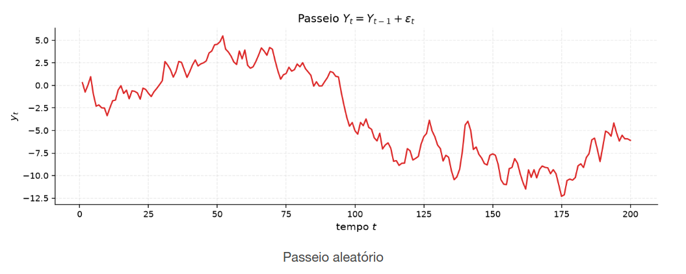

[Séries Temporais](index.md)

<!-- wiki:original:inicio -->

# Estacionariedade e ACF

## Introdução

Visualizamos anteriormente como utilizar de métodos **visuais** para identificar séries temporais, agora nosso foco vai ser formalizar esse conceito. Para tal, no entanto, precisamos definir alguns conceitos muito importantes, como média, covariância e a noção de **estacionariedade**

## Exemplos de Série

Esses serão os exemplos que vamos utilizar de forma recorrente

**Exemplo: Ruído Branco**

$$Y_{t} = \varepsilon_{t}$$ Não existe memória, cada instante contém um ruído que não conseguimos traçar a partir dos anteriores

**Exemplo: AR**

$$Y_{t} = \varphi Y_{t - 1} + \varepsilon_{t},\text{\quad\quad}\vert \varphi\vert  < 1$$ Depende diretamente do valor anterior, mas não de valores mais antigos. A memória é curta, mas existe

**Exemplo: Passeio Aleatório**

$$Y_{t} = Y_{t - 1} + \varepsilon_{t}$$ Acumula os ruídos passados, de forma que a memória é longa e o valor atual depende de todos os valores anteriores

**Exemplo: Tendência Linear**

$$Y_{t} = \beta_{0} + \beta_{1}t + \varepsilon_{t}$$ A tendência linear é um caso especial de passeio aleatório, onde o valor atual depende do tempo e de todos os valores anteriores

## Conceitos

**Definição: Função Média**

Seja $\left\{ Y_{t} \right\}$ uma série temporal onde ${\mathbb{E}}\left\lbrack Y_{t}^{2} \right\rbrack < \infty$, então a média em cada instante, denotada como $$\mu_{Y}(t) = {\mathbb{E}}\left\lbrack Y_{t} \right\rbrack$$

É a tendência central do processo ao longo de $t$. Em geral pode depender do tempo: nada obriga ${\mathbb{E}}\left\lbrack Y_{i} \right\rbrack = {\mathbb{E}}\left\lbrack Y_{j} \right\rbrack$ para $i \neq j$

Nos quatro exemplos que comentamos, temos que ${\mathbb{E}}\left\lbrack \varepsilon_{t} \right\rbrack = 0$, então temos que:

- **Ruído Branco**: $\mu_{Y}(t) = 0$

- **Tendência Linear**: $\mu_{Y}(t) = \beta_{0} + \beta_{1}t$

- **AR**: $\mu_{Y}(t) = \varphi \cdot \mu_{Y}(t - 1)$

- **Passeio Aleatório**: $\mu_{Y}(t) = \mu_{Y}(t - 1)$, se considerarmos $Y_{0} = 0$, então $\mu_{Y}(t) = 0$, perceba que se mantém constante, isso mostra que uma realização não altera a **média**, mas sim a **covariância** do processo, que cresce com o tempo

**Definição: Covariância**

Dados dois instantes $r,s$, definimos a covariância entre $Y_{r}$ e $Y_{s}$ como $$\gamma_{Y}(r,s) = {\mathbb{E}}\left\lbrack \left( Y_{r} - \mu_{Y}(r) \right)\left( Y_{s} - \mu_{Y}(s) \right) \right\rbrack$$

Para vermos como a correlação nos exemplos vistos se comportam, tenha em mente que ${\mathbb{V}}\left\lbrack \varepsilon_{t} \right\rbrack = \sigma^{2}$ e $\gamma_{\varepsilon}(r,s) = 0$ para $r \neq s$

- **Ruído Branco**: $\gamma_{Y}(r,s) = 0$ para $r \neq s$, ou seja, não existe correlação entre os valores da série temporal e $\gamma_{Y}(r,s) = \sigma^{2}$ se $r = s$, ou seja, a variância é constante ao longo do tempo

- **Tendência Linear**: $$\begin{aligned} \gamma_{Y(r,s)} & = \text{ Cov}\left( Y_{r},Y_{s} \right) \\ & = \text{ Cov}\left( \beta_{0} + \beta_{1}r + \varepsilon_{r},\beta_{0} + \beta_{1}s + \varepsilon_{s} \right) \\ & = \text{ Cov}\left( \varepsilon_{r},\varepsilon_{s} \right) \\ & = \begin{cases} \sigma^{2}\text{\quad\quad}r = s \\ 0\text{\quad\quad}r \neq s. \end{cases} \end{aligned}$$

- **AR**: Dado que $Y_{t} = \varphi Y_{t - 1} + \varepsilon_{t}$, então temos: $${\mathbb{V}}\left\lbrack Y_{t} \right\rbrack = {\mathbb{V}}\left\lbrack \varphi Y_{t - 1} + \varepsilon_{t} \right\rbrack = \varphi^{2}{\mathbb{V}}\left\lbrack Y_{t - 1} \right\rbrack + \sigma^{2}$$ e se assumirmos que $Y_{t} = Y_{t - 1}$: $${\mathbb{V}}\left\lbrack Y_{t} \right\rbrack = \varphi^{2}{\mathbb{V}}\left\lbrack Y_{t} \right\rbrack + \sigma^{2} \Rightarrow {\mathbb{V}}\left\lbrack Y_{t} \right\rbrack = \frac{\sigma^{2}}{1 - \varphi^{2}}$$

- **Passeio Aleatório**: Assumindo o caso onde $Y_{t} = \varepsilon_{1} + \varepsilon_{2} + \ldots + \varepsilon_{t}$, temos que: $${\mathbb{V}}\left\lbrack Y_{t} \right\rbrack = {\mathbb{V}}\left\lbrack \varepsilon_{1} + \varepsilon_{2} + \ldots + \varepsilon_{t} \right\rbrack = t\sigma^{2}$$ Ou seja, a variância do passeio aleatório cresce linearmente com o tempo. Além disso, a covariância entre dois instantes $r$ e $s$ é dada por $$\gamma_{Y}(r,s) = {\mathbb{E}}\left\lbrack Y_{r}Y_{s} \right\rbrack = {\mathbb{E}}\left\lbrack \left( \varepsilon_{1} + \ldots + \varepsilon_{r} \right)\left( \varepsilon_{1} + \ldots + \varepsilon_{s} \right) \right\rbrack = \min(r,s)\sigma^{2}$$

**Definição: Estacionariedade Fraca**

Dizemos que uma série temporal $\left\{ Y_{t} \right\}$ é **estacionária fraca** se:

- Média $\mu_{Y}(t)$ é constante no tempo

- Covariância $\gamma_{Y}(r,s)$ depende apenas da diferença $\vert r - s\vert$ e não dos instantes absolutos $r$ e $s$

Como vemos pelos exemplos, as únicas séries que são estacionárias fracas são o **ruído branco** e o **AR**. A tendência linear e o passeio aleatório não são estacionários fracos, pois a média e a covariância dependem do tempo

## ACF e ACVF

Como falamos, a covariância de uma série temporal estacionária fraca depende apenas da diferença entre os instantes, então podemos definir a função de covariância como uma função do lag $h = \vert r - s\vert$, assim:

**Definição: ACVF**

Dada a série temporal $\left\{ Y_{t} \right\}$ estacionária fraca, definimos a função de autocovariância como $$\gamma_{Y}(h) = {\mathbb{E}}\left\lbrack \left( Y_{r} - \mu_{Y} \right)\left( Y_{r + h} - \mu_{Y} \right) \right\rbrack$$

**Definição: ACF**

Dada a série temporal $\left\{ Y_{t} \right\}$ estacionária fraca, definimos a função de autocorrelação como $$\rho_{Y}(h) = \frac{\gamma_{Y}(h)}{\gamma_{Y}(0)}$$

A ACF é uma função que mede a correlação entre os valores da série temporal em diferentes lags. Ela nos ajuda a identificar padrões de dependência temporal e a determinar a ordem de modelos AR e MA, é como se ela fosse a função que mede a **memória** da série temporal. Vale ressaltar que não é porque uma série tem estacionaridade fraca que ela não possui memória, como vimos no caso do AR, que é estacionário fraco, mas possui memória curta. O mesmo não ocorre com o passeio aleatório, que não é estacionário fraco e possui memória longa

## IID v.s Ruído Branco

A distinção entre um processo **I.I.D.** (independente e identicamente distribuído) e um **Ruído Branco** (White Noise - WN) baseia-se na intensidade da independência estocástica exigida entre os instantes de tempo

**Definição: Ruído IID**

$\left\{ Y_{t} \right\} \sim \text{ I.I.D}\left( 0,\sigma^{2} \right)$ com $\sigma^{2} < \infty$ se $$\begin{aligned} {\mathbb{E}}\left\lbrack Y_{t} \right\rbrack & = 0 \\ \gamma_{Y}(h) & = \begin{cases} \sigma^{2}\text{\quad\quad}h = 0 \\ 0\text{\quad\quad}h \neq 0 \end{cases} \end{aligned}$$

Exige independência estocástica completa entre todas as variáveis aleatórias $Y_{t}$ e $Y_{s}$ ($t \neq s$). Não há qualquer dependência (linear ou não-linear) ou variação nas distribuições marginais

**Definição: Ruído Branco**

$\left\{ Y_{t} \right\} \sim \text{ WN}\left( 0,\sigma^{2} \right)$ com $\sigma^{2} < \infty$ se $$\begin{aligned} {\mathbb{E}}\left\lbrack Y_{t} \right\rbrack & = 0 \\ \gamma_{Y}(h) & = \begin{cases} \sigma^{2}\text{\quad\quad}h = 0 \\ 0\text{\quad\quad}h \neq 0 \end{cases} \end{aligned}$$

Exige apenas ausência de correlação linear ($\text{Cov}\left( Y_{t + h},Y_{t} \right) = 0$ para $h \neq 0$) e estacionariedade de 2ª ordem

**Teorema: Relação entre IID e White Noise**

$$
\text{ I.I.D }\left( 0,\sigma^{2} \right) \Rightarrow \text{ WN}\left( 0,\sigma^{2} \right)
$$

## Estimação Amostral

No dia a dia, não conseguimos dizer com precisão os parâmetros de uma série temporal, como a média e a covariância. Para contornar essa limitação, utilizamos estimadores amostrais, que são funções das observações da série temporal que nos permitem inferir sobre os parâmetros populacionais

**Definição: Estimador de média amostral de processo estocástico fracamente estacionário**

Dada uma realização $\left\{ y_{1},y_{2},\ldots,y_{T} \right\}$ de um processo estocástico fracamente estacionário $\{ Y_{t}\}$ com média populacional ${\mathbb{E}}\left\lbrack Y_{t} \right\rbrack = \mu$ e função de autocovariância $\gamma(h) = \text{ Cov}\left( Y_{t},Y_{t + h} \right)$, o estimador da média amostral é definido por $${\overline{Y}}_{t} = \frac{1}{T}\sum_{t = 1}^{T}Y_{t}$$

**Teorema: Não-viesamento e Variância da Média Amostral**

Se $\left\{ Y_{t} \right\}$ for um processo fracamente estacionário com ${\mathbb{E}}\left\lbrack Y_{t} \right\rbrack = \mu$ e autocovariância $\gamma(h)$ então

- ${\overline{Y}}_{t}$ é um estimador não-viezado de $\mu$

- A variância de ${\overline{Y}}_{t}$ é dada por $${\mathbb{V}}\left\lbrack {\overline{Y}}_{t} \right\rbrack = \frac{1}{T}\sum_{h = - (T - 1)}^{T - 1}\left( 1 - \frac{\vert h\vert }{T} \right)\gamma(h)$$

**Demonstração**

**Parte do não-viesamento**: Aplicamos a esperança no estimador $${\mathbb{E}}\left\lbrack {\overline{Y}}_{t} \right\rbrack = {\mathbb{E}}\left\lbrack \frac{1}{T}\sum_{t = 1}^{T}Y_{t} \right\rbrack = \frac{1}{T}\sum_{t = 1}^{T}{\mathbb{E}}\left\lbrack Y_{t} \right\rbrack = \frac{1}{T}\sum_{t = 1}^{T}\mu = \mu$$

**Parte da variância**: Pela definição da variância da soma de variáveis aleatórias, temos $${\mathbb{V}}\left\lbrack {\overline{Y}}_{t} \right\rbrack = {\mathbb{V}}\left\lbrack \frac{1}{T}\sum_{t = 1}^{T}Y_{t} \right\rbrack = \frac{1}{T^{2}}{\mathbb{V}}\left\lbrack \sum_{t = 1}^{T}Y_{t} \right\rbrack = \frac{1}{T^{2}}\sum_{r = 1}^{T}\sum_{s = 1}^{T}\text{ Cov}\left( Y_{r},Y_{s} \right)$$ como o processo é fracamente estacionário, podemos reescrever a covariância como uma função do lag $h = \vert r - s\vert$, assim $${\mathbb{V}}\left\lbrack {\overline{Y}}_{t} \right\rbrack = \frac{1}{T^{2}}\sum_{r = 1}^{T}\sum_{s = 1}^{T}\gamma(\vert r - s\vert )$$

se agruparmos os pares $(r,s)$ cuja a diferença $r - s$ seja igual a um determinado lag $h$ ($\left\{ - (T - 1),\ldots,T - 1 \right\}$), nota-se que existem exatamente $T - \vert h\vert$ pares com aquele lag $h$. Logo, podemos reescrever a soma como $${\mathbb{V}}\left\lbrack {\overline{Y}}_{t} \right\rbrack = \frac{1}{T^{2}}\sum_{h = - (T - 1)}^{T - 1}\left( T - \vert h\vert  \right)\gamma(h) = \frac{1}{T}\sum_{h = - (T - 1)}^{T - 1}\left( 1 - \frac{\vert h\vert }{T} \right)\gamma(h)$$

**Definição: Autocovariância Amostral**

A autocovariância amostral usual para um lag $h \geq 0$ é definida com o divisor $T$ $$\hat{\gamma}(h) = \frac{1}{T}\sum_{t = 1}^{T - h}\left( Y_{t} - {\overline{Y}}_{t} \right)\left( Y_{t + h} - {\overline{Y}}_{t} \right)\text{\quad\quad}0 \leq h < T$$

**Teorema: Propriedades do estimador de Autocovariância Amostral**

1.  O estimador de autocovariância amostral é viesado em amostra finita, mas é **assintoticamente não-viesado** (isto é, $\lim\limits_{T \rightarrow \infty}{\mathbb{E}}\left\lbrack \hat{\gamma}(h) \right\rbrack = \gamma(h)$)

2.  O uso do divisor $T$ em vez de $T - h$ garante que a matriz de autocovariância amostral seja **semi-definida positiva**, o que é importante para a consistência de estimadores de modelos de séries temporais e minimiza o MSE para lags elevados

**Demonstração**

Para simplificar a demonstração sem perder generalidade, considere inicialmente o estimador simplificado com $\mu$ conhecido $$\widetilde{\gamma}(h) = \frac{1}{T}\sum_{t = 1}^{T - h}\left( Y_{t} - \mu \right)\left( Y_{t + h} - \mu \right)$$ tomando a esperança desse estimador $$\begin{aligned} {\mathbb{E}}\left\lbrack \widetilde{\gamma}(h) \right\rbrack & = \frac{1}{T}\sum_{t = 1}^{T - h}{\mathbb{E}}\left\lbrack \left( Y_{t} - \mu \right)\left( Y_{t + h} - \mu \right) \right\rbrack \\ & = \frac{1}{T}\sum_{t = 1}^{T - h}\gamma(h) \\ & = \frac{T - h}{T}\gamma(h) \end{aligned}$$ logo $${\mathbb{E}}\left\lbrack \widetilde{\gamma}(h) \right\rbrack - \gamma(h) = - \frac{h}{T}\gamma(h)$$

Quando substituímos $\mu$ por ${\overline{Y}}_{t}$, o estimador se torna viesado, mas a diferença entre os dois estimadores é de ordem $O\left( \frac{1}{T} \right)$, logo, o estimador com média amostral também é assintoticamente não-viesado $$\lim\limits_{T \rightarrow \infty}{\mathbb{E}}\left\lbrack \hat{\gamma}(h) \right\rbrack = \lim\limits_{T \rightarrow \infty}\left( 1 - \frac{h}{T} \right)\gamma(h) = \gamma(h)$$

Com relação à matriz semi-definida positiva, considere o vetor de observações centradas $Y = \left( Y_{1} - {\overline{Y}}_{T},\ldots,Y_{T} - {\overline{Y}}_{T} \right)^{T}$. A matriz de autocovariância amostral de ordem $k \times k$ definida como $${\hat{\Gamma}}_{k} = \left\lbrack \hat{\gamma}(i - j) \right\rbrack_{i,j = 1}^{k}$$ pode ser escrita da seguinte forma matricial $${\hat{\Gamma}}_{k} = \frac{1}{T}X^{T}X$$ onde $X_{rj} = Y_{r - j + 1} - {\overline{Y}}_{T}$ para $r \in \left\{ 1,\ldots,T + k - 1 \right\}$ e $j \in \left\{ 1,\ldots,k \right\}$. Para qualquer vetor não-nulo $a = \left( a_{1},\ldots,a_{k} \right)^{T} \in {\mathbb{R}}^{k}$: $$a^{T}{\hat{\Gamma}}_{k}a = a^{T}\left( \frac{1}{T}X^{T}X \right)a = \frac{1}{T}(Xa)^{T}(Xa) = \frac{1}{T}\| Xa\| \geq 0$$ Se dividíssemos por $T - h$ em vez de $T$, esse cancelamento matricial exato falharia, podendo gerar matrizes de autocovariância amostrais não-definidas positivas (com variâncias teóricas negativas para combinações lineares da série) e maior variabilidade estatística em $h$ elevad

**Definição: Autocorrelação Amostral**

A autocorrelação amostral é a razão normalizada $$\hat{\rho}(h) = \frac{\hat{\gamma}(h)}{\hat{\gamma}(0)}$$

**Teorema: Distribuição Limite sob Hipótese IID - Bartlett**

Se $\left\{ Y_{t} \right\} \sim \text{ IID}\left( 0,\sigma^{2} \right)$ com ${\mathbb{E}}\left\lbrack Y_{t}^{4} \right\rbrack < \infty$, então para qualquer $h > 0$ fixo, quando $T \rightarrow \infty$: $$\sqrt{T}{\hat{\rho}}_{h}\overset{d}{\rightarrow}\mathcal{N}(0,1)$$ e isso implica que ${\hat{\rho}}_{h} \approx \mathcal{N}(0,\frac{1}{T})$ para $T$ grande

**Demonstração**

Sob a hipótese de ruído IID, temos que $\mu = 0$, $\gamma(0) = \sigma^{2}$ e $\gamma(k) = 0\ \forall k \neq 0$.

**Passo 1 - Comportamento do Numerador**: Considere o estimador $\widetilde{\gamma}(h) = \frac{1}{T}\sum_{t = 1}^{T - h}Y_{t}Y_{t + h}$. Defina a sequência de variáveis $W_{t} = Y_{t}Y_{t + h}$. Como $\left\{ Y_{t} \right\}$ é IID, de média $0$

1.  ${\mathbb{E}}\left\lbrack W_{t} \right\rbrack = {\mathbb{E}}\left\lbrack Y_{t}Y_{t + h} \right\rbrack = {\mathbb{E}}\left\lbrack Y_{t} \right\rbrack{\mathbb{E}}\left\lbrack Y_{t + h} \right\rbrack = 0$

2.  Para $t \neq s$, as variáveis $W_{t}$ e $W_{s}$ são não-correlacionadas (Formam uma sequência de diferenças de martingale)

3.  ${\mathbb{V}}\left\lbrack W_{t} \right\rbrack = {\mathbb{E}}\left\lbrack W_{t}^{2} \right\rbrack = {\mathbb{E}}\left\lbrack Y_{t}^{2}Y_{t + h}^{2} \right\rbrack = {\mathbb{E}}\left\lbrack Y_{t}^{2} \right\rbrack{\mathbb{E}}\left\lbrack Y_{t + h}^{2} \right\rbrack = \sigma^{4}$

Pelo Teorema Central do Limite, para Sequências de Diferenças de Martingale, temos que $$\sqrt{T}\widetilde{\gamma}(h) = \frac{1}{\sqrt{T}}\sum_{t = 1}^{T - h}W_{t}\overset{d}{\rightarrow}\mathcal{N}(0,\sigma^{4})$$

**Passo 2 - Comportamento do Denominador**: O denominador $\hat{\gamma}(0)$, pela lei forte dos grandes números: $$\hat{\gamma}(0) = \frac{1}{T}\sum_{t = 1}^{T}\left( Y_{t} - {\overline{Y}}_{T} \right)^{2}\overset{p}{\rightarrow}{\mathbb{V}}\left\lbrack Y_{t} \right\rbrack = \sigma^{2}$$

**Passo 3 - Aplicação do Teorema de Slutsky**: A autocorrelação pode escrita como $$\sqrt{T}\hat{\rho}(h) = \sqrt{T}\frac{\widetilde{\gamma}(h)}{\hat{\gamma}(0)}$$

Como a substituição de ${\overline{Y}}_{T}$ por $\mu = 0$ introduz apenas termos de ordem $o_{p}(1)$ (que somem assintoticamente), aplicamos o Teorema de Slutsky combinando a convergência em distribuição do numerador com a convergência em probabilidade do denominador: $$\sqrt{T}\hat{\rho}(h) = \frac{\sqrt{T}\hat{\gamma}(h)}{\hat{\gamma}(0)}\overset{d}{\rightarrow}\frac{\mathcal{N}(0,\sigma^{4})}{\sigma^{2}} = \mathcal{N}\left( 0,\frac{\sigma^{4}}{\left( \sigma^{2} \right)^{2}} \right) = \mathcal{N}(0,1)$$

**Corolário: Construção formal do intervalo de confiança da ACF**

Do [\[acf-amostral-dist\]](#acf-amostral-dist), decorre que quando temos um ruído IID e amostras grandes, podemos construir um intervalo de confiança para a autocorrelação amostral. Para um nível de confiança $1 - \alpha$: $$\begin{array}{r} {\mathbb{P}}( - z_{1 - \alpha/2} \leq \sqrt{T}\hat{\rho}(h) \leq z_{1 - \alpha/2}) \approx 1 - \alpha \\ {\mathbb{P}}( - \frac{z_{1 - \alpha/2}}{\sqrt{T}} \leq \hat{\rho}(h) \leq \frac{z_{1 - \alpha/2}}{\sqrt{T}}) \approx 1 - \alpha \end{array}$$

Com esse corolário, podemos interpretar o seguinte: Em um teste de nível de significância $\alpha = 0.05$ (confiança $95\%$), usamos o quantil $z_{0.975} \approx 1.96$, logo o intervalo de confiança é dado por $$\left\lbrack - \frac{1.96}{\sqrt{T}},\frac{1.96}{\sqrt{T}} \right\rbrack$$

se o valor amostral $\hat{\rho}(h)$ ultrapassar um desses limites, então rejeita-se a hipótese nula $H_{0}$ da **ausência de autocorrelação** no lag $h$, ou seja, existe evidência de que a série temporal possui memória linear. Caso contrário, não rejeitamos a hipótese nula, indicando que não há evidência suficiente para afirmar que existe autocorrelação nesse lag

------------------------------------------------------------------------

<!-- wiki:original:fim -->

## Percurso de estudo

[Trilha: A1](../../trilhas/series-temporais/a1.md) · [Apresentação e contexto da fonte](../../trilhas/series-temporais/a1.md#apresentacao-original)

- Anterior: [Diagnóstico Visual](diagnostico-visual.md)
- Próximo: [Previsão e Baselines](previsao-e-baselines/index.md)
