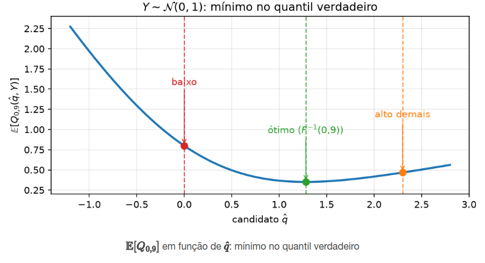
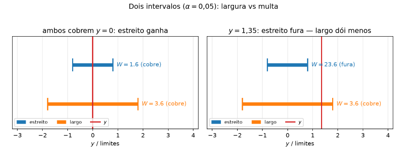
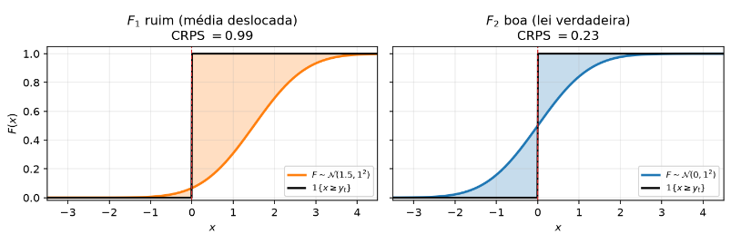

[Séries Temporais](index.md)

<!-- wiki:original:inicio -->

# Métricas de Avaliação

## Erro de previsão V.S Resíduos

Antes de aprendermos sobre métricas de avaliação, é importante destacarmos a diferença entre **erro de previsão** e **resíduo**, a diferença é sutil e se encontra no fato da amostra **estar** ou **não estar** no conjunto de treino (ajuste do modelo)

- **Resíduo** $e_{t} = y_{t} - {\hat{y}}_{t\vert t - 1}\ \forall t \in \left\{ 1,\ldots,T \right\}$: Mede a discrepância entre a observação real e o valor ajustado dentro da **amostra utilizada para calibrar o modelo**

- **Erro de previsão** $e_{T + h} = y_{T + h} - {\hat{y}}_{T + h\vert T}\ \forall h \geq 1$: Mede a discrepância entre a observação real e o valor previsto **fora da amostra utilizada para calibrar o modelo**

## Métricas de Avaliação Pontual

Para as próximas definições, defina $H$ como o número de pontos **do conjunto de testes** que você reservou para a análise.

### Métricas de Escala

Fornecem medidas de erro expressa na mesma escala dos dados (ex: R\$, litros, galões etc.), tornando a interpretação direta.

**Definição: Erro Absoluto Médio (MAE)**

$$
\text{ MAE } = \frac{1}{H}\sum_{h = 1}^{H}\vert e_{T + h}\vert
$$

O interessante dessa métrica é que o erro é tratado de forma proporcional, então errar $10$ unidades machuca no bolso exatamente $10$ vezes mais que errar $1$ unidade. Utilizamos esse erro quando o custo operacional/financeiro cresce proporcionalmente ao erro cometido. Já vimos em teoremas de outras disciplinas que o MAE é minimizado pela **mediana** da distribuição de erros, ou seja, o preditor que minimiza o MAE é $\text{MED}\left( Y_{T + h\vert Y_{T}} \right)$

**Definição: Root Mean Squared Error**

$$
\text{ RMSE } = \sqrt{\frac{1}{H}\sum_{h = 1}^{H}e_{T + h}^{2}}
$$

O erro RMSE penaliza erros grandes de forma mais severa, pois o erro é elevado ao quadrado. Utilizamos esse erro quando o custo operacional/financeiro de uma falha pequena é relevante, mas o custo de uma falha grande é inaceitável. Por exemplo, na previsão de demanda de energia elétrica, um erro de $10$MW não é $10$ vezes pior do que um de $1$MW — ele pode derrubar a rede elétrica e causar um apagão. O quadrado captura essa *“gravidade exponencial”*. Também vimos em disciplinas passadas que o preditor que minimiza esse erro é ${\mathbb{E}}\left\lbrack Y_{T + h\vert T} \right\rbrack$

Por mais interessantes que essas métricas seja, existe um claro problema com elas, eles **não** podem ser usados para comparar erros de séries temporais com **escalas ou magnitudes diferentes**.

**Exemplo: Escalas iguais, magnitudes diferentes**

Vamos pensar em um varejo com dois produtos $A$ e $B$, onde o produto $A$ vende aproximadamente $10$ por dia, enquanto o $B$ vende $10000$ por dia. Se o modelo de previsão tem um $\text{MAE}$ de $10$ para ambos, enquanto no produto $B$ isso é irrelevante, já que é uma quantidade de produtos errados muito baixa comparado ao volume de vendas, para o produto $A$ isso é um **completo desastre**, pois o modelo errou a previsão de vendas em $100\%$.

### Erros Percentuais

Essas são as métricas que são **livres de escala**, permitindo comparação entre séries temporais com magnitudes diferentes e permitem fácil comunicação com stakeholders

**Definição: Mean Absolute Percentage Error**

$$
\begin{array}{r} P_{j} = 100 \cdot \frac{e_{j}}{y_{j}} \\ \text{MAPE } = \frac{1}{H}\sum_{j = 1}^{H}\vert P_{j}\vert \end{array}
$$

Por mais útil que esse erro seja, ainda existem alguns pontos para se ficar atento. Se $y_{j} = 0$ o $\text{MAPE}$ é indefinido, e se $y_{j}$ é muito pequeno, o $\text{MAPE}$ pode **explodir**. Além disso, o $\text{MAPE}$ é **assimétrico**, ou seja, ele penaliza mais previsões que **subestimam** a demanda do que previsões que **superestimam** a demanda

**Exemplo: Assimetria do $\text{MAPE}$**

Suponha que $y = 1$ e $\hat{y} = 2$, então o erro percentual é $\vert P\vert  = \vert 100 \cdot \frac{1 - 2}{1}\vert  = 100\%$, agora basta inverter e assumir $y = 2$ e $\hat{y} = 1$ e teremos $\vert P\vert  = \vert 100 \cdot \frac{2 - 1}{2}\vert  = 50\%$

### Erros Escalados

A ideia desse erro é calcular o $\text{MAE}$ do seu modelo e dividir esse erro pelo erro de um modelo **ingênuo** (baseline)

**Definição: Mean Absolute Scaled Error**

Em séries não-sazonais

$$
q_{j} = \frac{e_{j}}{\frac{1}{T - 1}\sum_{t = 2}^{T}\vert y_{t} - y_{t - m}\vert }
$$

 em séries sazonais

$$
q_{j} = \frac{e_{j}}{\frac{1}{T - m}\sum_{t = m + 1}^{T}\vert y_{t} - y_{t - m}\vert }
$$

 e o $\text{MASE}$ é dado por

$$
\text{ MASE } = \frac{1}{H}\sum_{j = 1}^{H}\vert q_{j}\vert
$$

Cada $q_{j}$ indica a quantos *“passos típicos de passeio aleatório”* equivale o erro de teste.

- $\text{MASE } < 1$: Na janela de teste, o modelo foi superior ao Naive.

- $\text{MASE } = 1$: O modelo empatou com o Naive.

- $\text{MASE } > 1$: O modelo é pior que o Naive.

A escala é calculada no treino (ficando fixa antes do teste). Não sofre com zeros no teste, não é assimétrica e permite comparar métodos em coleções mistas de séries

## Métricas de Avaliação Distribucional

$\text{MAE}$ e $\text{RMSE}$ avaliam **um** número $\hat{y}$. O intervalo $\hat{y} \pm 1.96{\hat{\sigma}}_{h}$ era um recorde de uma **distribuição preditiva** $F$ de $Y_{t + h}$ dado o passado. Agora nós gostaríamos de avaliar a **distribuição preditiva**.

### Erro de Quantil

Avalia a precisão de um quantil ${\hat{q}}_{t + h\vert T}$ da distribuição preditiva $F$ de $Y_{t + h}$ dado o passado.

**Definição: Pinball Loss**

$$
Q_{p,t}\left( {\hat{q}}_{p,t},y_{t} \right) = \begin{cases} 2(1 - p)\left( {\hat{q}}_{p,t} - y_{t} \right)\text{\quad\quad} & y_{t} < {\hat{q}}_{p,t} \\ 2p\left( y_{t} - {\hat{q}}_{p,t} \right)\text{\quad\quad} & y_{t} \geq {\hat{q}}_{p,t} \end{cases}
$$

O valor de $y$ que minimiza ${\mathbb{E}}\lbrack Q\rbrack$ é o **quantil verdadeiro** da distribuição

**Teorema: Minimizador teórico de $Q$**

Seja $Y$ uma variável aleatória contínua com função de distribuição acumulada (cdf) $F_{Y}(y) = {\mathbb{P}}(Y \leq y)$ estritamente crescente e função de densidade de probabilidade $f_{Y}(y) > 0$

Para um quantil fixado $p \in (0,1)$, seja a função de perca de quantil $Q_{p}(q,Y)$ definida em [perda de quantil](#pinball-loss), a esperança do risco associado

$$
\mathcal{L} = {\mathbb{E}}\left\lbrack Q_{p}(q,Y) \right\rbrack
$$

 atinge seu mínimo global estrito se e somente se o candidato $q$ for o $p$-quantil verdadeiro da distribuição de $Y$

$$
q^{\ast} = F_{Y}^{- 1}(p)
$$

**Demonstração**

$$
\mathcal{L}(q) = \int_{- \infty}^{\infty}Q_{p}(q,y)f_{Y}(y)dy
$$

 Dividindo a integral no ponto de corte $q$

$$
\mathcal{L}(q) = \int_{- \infty}^{q}2(1 - p)(q - y)f_{Y}(y)dy + \int_{q}^{\infty}2p(y - q)f_{Y}(y)dy
$$

$$
\mathcal{L}(q) = \underset{\text{ f}}{\underbrace{2(1 - p)\int_{- \infty}^{q}(q - y)f_{Y}(y)dy}} + \underset{\text{ g}}{\underbrace{2p\int_{q}^{\infty}(y - q)f_{Y}(y)dy}}
$$

 Aplicando a regra de leibniz para derivadas de integrais, temos que

$$
\frac{d}{dq}\mathcal{L}(q) = d\frac{f}{dq} + d\frac{g}{dq}
$$

$$
\frac{df}{dq} = 2(1 - p)\left\lbrack (q - q)f_{Y}(q) + \int_{- \infty}^{q}\frac{\partial}{\partial q}(q - y)f_{Y}(y)dy \right\rbrack = 2(1 - p)F_{Y}(q)
$$

$$
\frac{dg}{dq} = 2p\left\lbrack - (q - q)f_{Y}(q) + \int_{q}^{\infty}\frac{\partial}{\partial q}(y - q)f_{Y}(y)dy \right\rbrack = - 2p\left( 1 - F_{Y}(q) \right)
$$

 Logo, para achar o ponto de mínimo:

$$
\begin{array}{r} 0 = 2(1 - p)F_{Y}(q) - 2p\left( 1 - F_{Y}(q) \right) \\ 0 = (1 - p)F_{Y}(q) - p + pF_{Y}(q) \\ p = (1 - p + p)F_{Y}(q) \\ F_{Y}(q) = p \\ q^{\ast} = F_{Y}^{- 1}(p) \end{array}
$$

 A existência de $F_{Y}^{- 1}(p)$ é garantida pois $F_{Y}$ é estritamente crescente. Derivando novamente em relação a $q$

$$
\frac{d^{2}\mathcal{L}}{dq^{2}} = \frac{d}{dq}\left\lbrack 2\left( F_{Y}(q) - p \right) \right\rbrack = 2f_{Y}(q)
$$

 como $f_{Y}(q) > 0$ no suporte de $Y$, temos que a segunda derivada é estritamente positiva, garantindo que $q^{\ast} = F_{Y}^{- 1}(p)$ seja o **único mínimo global estrito**

*Figura 19. Gráfico de comparação entre a média do pinball error com relação ao valor cadidato do quantil*

### Score de Winkler

Avalia a precisão de um intervalo de previsão $\hat{I} = \left\lbrack l_{\alpha,t},u_{\alpha,t} \right\rbrack$ de nível de confiança $1 - \alpha$ para a distribuição preditiva $F$ de $Y$

**Definição: Score de Winkler**

$$
W_{\alpha}\left( l,u,y_{t} \right) = \begin{cases} (u - l) + \frac{2}{\alpha}\left( l - y_{t} \right)\text{\quad\quad} & y_{t} < l \\ u - l\text{\quad\quad} & l \leq y_{t} \leq u \\ (u - l) + \frac{2}{\alpha}\left( y_{t} - u \right)\text{\quad\quad} & y_{t} > u \end{cases}
$$

 onde $l$ e $u$ são os limites inferior e superior do intervalo de previsão, respectivamente, e $y_{t}$ é o valor observado.

A lógica desse score é que, se o valor observado $y_{t}$ estiver dentro do intervalo de previsão, o score é apenas o tamanho do intervalo, de forma que intervalos mais curtos são preferíveis. Se o valor observado estiver fora do intervalo, o score penaliza a distância do valor observado para o limite mais próximo do intervalo, de forma que intervalos que **não cobrem** o valor observado são penalizados.

Existe uma conexão entre o score de Winkler e a Pinball Loss

**Teorema: Decomposição do Score de Winkler**

O score de winkler se decompõe como a soma escalada das Pinball Losses nos quantis $p_{1} = \frac{\alpha}{2}$ e $p_{2} = 1 - \frac{\alpha}{2}$

$$
W_{\alpha}\left( l,u,y_{t} \right) = \frac{1}{\alpha}\left\lbrack Q_{\frac{\alpha}{2}}(l,y) + Q_{1 - \frac{\alpha}{2}}(u,y) \right\rbrack
$$

**Demonstração**

A Pinball Loss para um quantil $p$ e um candidato $q$ é dada por:

$$
Q_{p(q,y)} = \begin{cases} 2(1 - p)(q - y)\text{\quad\quad} & y < q \\ 2p(y - q)\text{\quad\quad} & y \geq q \end{cases}
$$

 Avaliamos a soma $Q_{\frac{\alpha}{2}}(l,y) + Q_{1 - \frac{\alpha}{2}}(u,y)$ para os três casos possíveis em relação ao intervalo $\lbrack l,u\rbrack$:

**Caso 1**: $y < l$ (e $y < u$):

$$
\begin{aligned} Q_{\frac{\alpha}{2}}(l,y) & = 2\left( 1 - \frac{\alpha}{2} \right)(l - y) \\ & = (2 - \alpha)(l - y) \\ Q_{1 - \frac{\alpha}{2}}(u,y) & = 2\left( 1 - \left( 1 - \frac{\alpha}{2} \right) \right)(u - y) \\ & = 2\left( \frac{\alpha}{2} \right)(u - y) \\ & = \alpha(u - y) \end{aligned}
$$

 somando os dois termos:

$$
Q_{\frac{\alpha}{2}}(l,y) + Q_{1 - \frac{\alpha}{2}}(u,y) = (2 - \alpha)(l - y) + \alpha(u - y) = 2(l - y) + \alpha(u - l)
$$

 dividindo por $\alpha$:

$$
\frac{1}{\alpha}\left\lbrack Q_{\frac{\alpha}{2}}(l,y) + Q_{1 - \frac{\alpha}{2}}(u,y) \right\rbrack = (u - l) + \frac{2}{\alpha}(l - y) = W_{\alpha}(l,u,y)
$$

**Caso 2**: $l \leq y \leq u$:

$$
\begin{aligned} Q_{\frac{\alpha}{2}}(l,y) & = 2\left( \frac{\alpha}{2} \right)(y - l) \\ & = \alpha(y - l) \\ Q_{1 - \frac{\alpha}{2}}(u,y) & = 2\left( (\alpha)(2) \right)(u - y) \\ & = \alpha(u - y) \end{aligned}
$$

 somando os dois termos:

$$
Q_{\frac{\alpha}{2}}(l,y) + Q_{1 - \frac{\alpha}{2}}(u,y) = \alpha(y - l) + \alpha(u - y) = \alpha(u - l)
$$

 dividindo por $\alpha$:

$$
\frac{1}{\alpha}\left\lbrack Q_{\frac{\alpha}{2}}(l,y) + Q_{1 - \frac{\alpha}{2}}(u,y) \right\rbrack = u - l = W_{\alpha}(l,u,y)
$$

**Caso 3**: $y > u$ (e $y > l$):

$$
\begin{aligned} Q_{\frac{\alpha}{2}}(l,y) & = \alpha(y - l) \\ Q_{1 - \frac{\alpha}{2}}(u,y) & = 2\left( 1 - (\alpha)(2) \right)(y - u) \\ & = (2 - \alpha)(y - u) \end{aligned}
$$

 somando os dois termos:

$$
Q_{\frac{\alpha}{2}}(l,y) + Q_{1 - \frac{\alpha}{2}}(u,y) = \alpha(y - l) + (2 - \alpha)(y - u) = \alpha(u - l) + 2(y - u)
$$

 dividindo por $\alpha$:

$$
\frac{1}{\alpha}\left\lbrack Q_{\frac{\alpha}{2}}(l,y) + Q_{1 - \frac{\alpha}{2}}(u,y) \right\rbrack = (u - l) + (2)(\alpha)(y - u) = W_{\alpha(l,u,y)}
$$

Isso prova a identidade funcional $W_{\alpha}(l,u,y) = \frac{1}{\alpha}\left\lbrack Q_{\frac{\alpha}{2}}(l,y) + Q_{1 - \frac{\alpha}{2}}(u,y) \right\rbrack$

**Teorema: Mínimo global do Score de Winkler**

A esperança do Score de Winkler ${\mathbb{E}}\left\lbrack W_{\alpha}\left( l,u,y_{t} \right) \right\rbrack$ atinge seu mínimo global estrito se, e somente se, os limites $l^{\ast}$ e $u^{\ast}$ forem os quantis teóricos verdadeiros de $y$

$$
\begin{aligned} l^{\ast} & = F_{Y}^{- 1}\left( \frac{\alpha}{2} \right) \\ u^{\ast} & = F_{Y}^{- 1}\left( 1 - \frac{\alpha}{2} \right) \end{aligned}
$$

**Demonstração**

Aplicando a linearidade da esperança e utilizando do [decomposição do score de Winkler](#winkler-score-decomposition), temos que

$$
{\mathbb{E}}\left\lbrack W_{\alpha}\left( l,u,y_{t} \right) \right\rbrack = \frac{1}{\alpha}\left\lbrack {\mathbb{E}}\left\lbrack Q_{\frac{\alpha}{2}}(l,y) \right\rbrack + {\mathbb{E}}\left\lbrack Q_{1 - \frac{\alpha}{2}}(u,y) \right\rbrack \right\rbrack
$$

 como o limite inferior $l$ aparece apenas no primeiro termo e o limite superior $u$ no segundo, então a minimização conjunta de ${\mathbb{E}}\left\lbrack W_{\alpha}\left( l,u,y_{t} \right) \right\rbrack$ se divide em duas otimizações diferentes

$$
\min\limits_{l}{\mathbb{E}}\left\lbrack Q_{\frac{\alpha}{2}}\left( l,y_{t} \right) \right\rbrack\text{\quad\quad}\min\limits_{l}{\mathbb{E}}\left\lbrack Q_{1 - \frac{\alpha}{2}}\left( u,y_{t} \right) \right\rbrack
$$

 Pelo [minimizador da perda de quantil](#pinball-loss-minimizer), sabemos que o mínimo global de cada termo é atingido quando $l$ e $u$ são os quantis verdadeiros da distribuição de $y$, ou seja

$$
\begin{aligned} l^{\ast} & = F_{Y}^{- 1}\left( \frac{\alpha}{2} \right) \\ u^{\ast} & = F_{Y}^{- 1}\left( 1 - \frac{\alpha}{2} \right) \end{aligned}
$$

*Figura 20. Dois intervalos. Se o curto cobre o valor observado, ele é preferível. Se o curto não cobre, ele pode ser penalizado e o maior ganhar*

### Continuous Ranked Probability Score

Avalia a CDF preditiva inteira $F(x)$ contra a função degrau empírica da realização real ${\mathbb{I}}(x \geq y_{t})$

**Definição: Continuous Ranked Probability Score**

$$
\text{ CRPS}\left( F,y_{t} \right) = \int_{- \infty}^{\infty}\left( F(x) - {\mathbb{I}}(x \geq y_{t}) \right)^{2}dx
$$

Ela mede a área entre a CDF prevista e o degrau unitário empírico em $y_{t}$ (quanto menor a área, melhor). A ideia é que, quanto mais a CDF se curva para cima no ponto $y_{t}$, maior a probabilidade de que a realização real seja $y_{t}$ verdadeiro, de forma que o caso extremo é justamente a função degrau unitário.

Existem dois teoremas interessantes que conectam o CRPS com a métrica de avaliação da pinball

**Teorema: Equivalência da CRPS**

Seja $Y$ uma variável contínua aleatória com CDF $F_{Y}$ estritamente crescente, o CRPS de $F_{Y}$ com relação a uma realização $y$ é equivalente à integral da Pinball Loss sobre todos os quantis, ou seja:

$$
\int_{- \infty}^{\infty}\left( F_{Y}(x) - {\mathbb{I}}(x \geq y) \right)^{2}dx = \int_{0}^{1}Q_{p}\left( F_{Y}^{- 1}(p),y \right)dp
$$

**Demonstração**

Para $x < y$, a função indicador vale ${\mathbb{I}}\left\{ x \geq y \right\} = 0 \Rightarrow \left( F(x) - 0 \right)^{2} = {F(x)}^{2}$. Para $x \geq y$, a função indicadora vale ${\mathbb{I}}_{\left\{ x \geq y \right\}} = 1 \Rightarrow \left( F(x) - 1 \right)^{2} = \left( 1 - F(x) \right)^{2}$.

Assim, a integral do CRPS decompõe-se em duas regiões:

$$
\text{ CRPS}(F,y) = \int_{- \infty}^{y}{F(x)}^{2}dx + \int_{y}^{+ \infty}\left( 1 - F(x) \right)^{2}dx
$$

Aplicando a mudança de variável por integração por partes na escala de quantis

$$
p = F(x) \Leftrightarrow x = F^{- 1}(p)
$$

Para a primeira integral ($x < y \Leftrightarrow p < F(y)$):

$$
\int_{0}^{F(y)}2p\left( y - F^{- 1}(p) \right)dp = \int_{- \infty}^{y}{F(x)}^{2}dx
$$

Note que $2p\left( y - F^{- 1}(p) \right)$ é exatamente a Pinball Loss $Q_{p\left( F^{- 1}(p),y \right)}$ quando a previsão subestima o valor real ($y \geq q$).

Para a segunda integral ($x \geq y \Leftrightarrow p \geq F(y)$):

$$
\int_{F(y)}^{1}2(1 - p)\left( F^{- 1}(p) - y \right)dp = \int_{y}^{+ \infty}\left( 1 - F(x) \right)^{2}dx
$$

Note que $2(1 - p)\left( F^{- 1}(p) - y \right)$ é exatamente a Pinball Loss $Q_{p\left( F^{- 1}(p),y \right)}$ quando a previsão superestima o valor real ($y < q$).

Somando ambas as integrais ao longo do intervalo $p \in (0,1)$:

$$
\text{ CRPS}(F,y) = \int_{0}^{1}Q_{p}\left( F^{- 1}(p),y \right)dp
$$

Ou seja, enquanto o erro de quantil avalia apenas uma fatia $p$ e o wrinkler avalia um intervalo fixo $\left( \frac{\alpha}{2},1 - \frac{\alpha}{2} \right)$, o CRPS avalia a perda de **todos** os quantis do espaço amostral continuamente

**Teorema: Representação do CRPS por variáveis aleatórias latentes**

Sejam $X$ e $X'$ duas variáveis aleatórias independentes com a mesma distribuição $F$, então, o CRPS pode ser representado como

$$
\text{ CRPS}(F,y) = {\mathbb{E}}_{F}\vert X - y\vert  - \frac{1}{2}{\mathbb{E}}_{F}\vert X - X'\vert
$$

**Demonstração**

Utilizamos a identidade integral da distância escalar para quaisquer números reais

$$
a,b \in {\mathbb{R}}\text{\quad\quad}\vert a - b\vert  = \int_{- \infty}^{+ \infty}\left( {\mathbb{I}}\left\{ a \leq x \right\} - {\mathbb{I}}\left\{ b \leq x \right\} \right)^{2}dx
$$

 **Cálculo do primeiro termo** (${\mathbb{E}}_{F}\vert X - y\vert$): Como ${\mathbb{E}}_{F}\left\lbrack {\mathbb{I}}\left\{ X \leq x \right\} \right\rbrack = {\mathbb{P}}(X \leq x) = F(x)$ e ${\mathbb{I}}\left\{ y \leq x \right\}$ é determinística:

$$
\begin{aligned} {\mathbb{E}}_{F}\vert X - y\vert  & = \int_{- \infty}^{+ \infty}{\mathbb{E}}_{F}\left\lbrack {\mathbb{I}}\left\{ X \leq x \right\} - {\mathbb{I}}\left\{ y \leq x \right\} \right\rbrack^{2}dx \\ & = \int_{- \infty}^{+ \infty}\left( F(x) - 2F(x){\mathbb{I}}\left\{ y \leq x \right\} + {\mathbb{I}}\left\{ y \leq x \right\} \right)dx \end{aligned}
$$

**Cálculo do segundo termo** (${\mathbb{E}}_{F}\vert X - X'\vert$): Como $X$ e $X'$ são i.i.d. com ${\mathbb{E}}\left\lbrack {\mathbb{I}}\left\{ X \leq x \right\}{\mathbb{I}}\left\{ X' \leq x \right\} \right\rbrack = {F(x)}^{2}$:

$$
{\mathbb{E}}_{F}\vert X - X'\vert  = \int_{- \infty}^{+ \infty}\left( F(x) - 2{F(x)}^{2} + F(x) \right)dx = 2\int_{- \infty}^{+ \infty}\left( F(x) - {F(x)}^{2} \right)dx
$$

 dividindo por 2:

$$
\frac{1}{2}{\mathbb{E}}_{F}\vert X - X'\vert  = \int_{- \infty}^{+ \infty}\left( F(x) - {F(x)}^{2} \right)dx
$$

Subtraindo os dois termos:

$$
\begin{aligned} {\mathbb{E}}_{F}\vert X - y\vert  - \frac{1}{2}{\mathbb{E}}_{F}\vert X - X'\vert  & = \int_{- \infty}^{+ \infty}\left( {F(x)}^{2} - 2F(x){\mathbb{I}}\left\{ y \leq x \right\} + {\mathbb{I}}\left\{ y \leq x \right\} \right)dx \\ & = \int_{- \infty}^{+ \infty}\left( F(x) - {\mathbb{I}}\left\{ y \leq x \right\} \right)^{2}dx \\ & = \text{ CRPS}(F,y) \end{aligned}
$$

Mas por que essa representação me é útil? Primeiro que ela é uma **decomposição**, onde ${\mathbb{E}}_{F}\vert X - y\vert$ é a acurácia/calibração, medindo o erro absoluto médio esperado entre as simulações do modelo e o valor real observado e ${\mathbb{E}}_{F}\vert X - X'\vert$ é a nitidez/dispersão, medindo a variabilidade/espalhamento interno da própria distribuição do modelo. Como entra com sinal negativo na perda, **recompensa distribuições mais concentradas (nítidas)** e pune incerteza desnecessária. Outro ponto positivo é que, em algoritmos de séries temporais que geram $M$ trajetórias simuladas no futuro via **Bootstrap** $\left\{ x^{(1)},x^{(2)},\ldots,x^{(M)} \right\}$, não precisamos calcular nenhuma integral numérica da CDF $F(x)$. O CRPS empírico é calculado diretamente por somatório discreto:

$$
\text{ CRPS } = \frac{1}{M}\sum_{m = 1}^{M}\vert x^{(m)} - y\vert  - \frac{1}{2M^{2}}\sum_{m = 1}^{M}\sum_{n = 1}^{M}\vert x^{(m)} - x^{(n)}\vert
$$

*Figura 21. Ilustração do CRPS. $F_{1}$ com média descolada e $F_{2}$ verdadeira*
<!-- wiki:original:fim -->

## Conteúdos relacionados

- [Métricas de Avaliação — Aprendizado Profundo](../aprendizado-profundo/object-detection/metricas-de-avaliacao.md)
- [Métricas de Avaliação — Aprendizado Profundo](../aprendizado-profundo/segmentacao-semantica/introducao-e-metricas.md#metricas-de-avaliacao)

## Percurso de estudo

[Trilha: A1](../../trilhas/series-temporais/a1.md) · [Apresentação e contexto da fonte](../../trilhas/series-temporais/a1.md#apresentacao-original)

- Anterior: [Diagnóstico de Resíduos](diagnostico-de-residuos.md)

- Próximo: [Transformações](transformacoes.md)
