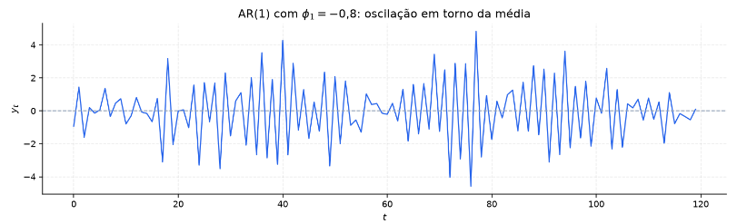
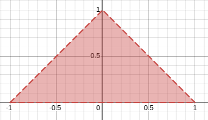
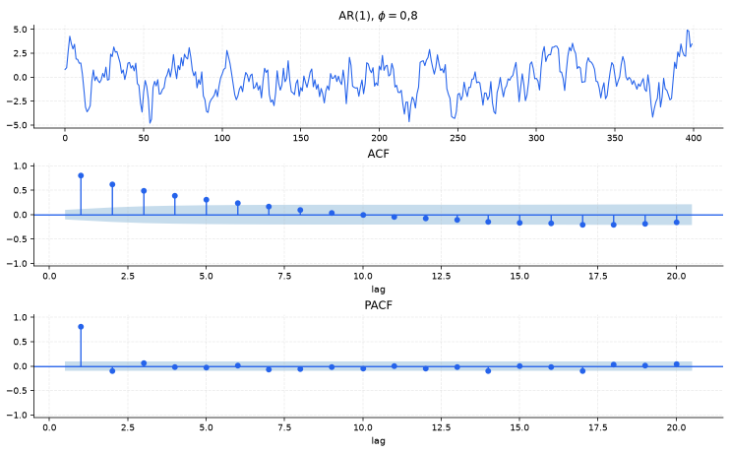

[Séries Temporais](index.md)

<!-- wiki:original:inicio -->

# Modelo AR e PACF

## Modelos Autoregressivos ($\text{AR}$)

Um $\text{AR}(p)$ descreve a variável objetivo $y_{t}$ como uma regressão linear nos próprios lags da série temporal

$$
y_{t} = C + \varphi_{1}y_{t - 1} + \varphi_{2}y_{t - 2} + \ldots + \varphi_{p}y_{t - p} + \varepsilon_{t}\text{\quad\quad}\varepsilon_{t} \sim \text{ WN}\left( 0,\sigma^{2} \right)
$$

Aqui, como os preditores são os próprios valores anteriores da série, a dependência temporal entra de forma explícita no modelo.

### Caso especial $\text{AR}(1)$

$$
y_{t} = C + \varphi_{1}y_{t - 1} + \varepsilon_{t}\text{\quad\quad}\varepsilon_{t} \sim \text{ WN}\left( 0,\sigma^{2} \right)
$$

 Este é o modelo mais simples de um processo autoregressivo, onde a variável objetivo depende apenas do seu valor anterior.

- $\varphi_{1} = 0,C = 0$: $y_{t} = \varepsilon_{t}$ (Ruído Branco).

- $\varphi_{1} = 1,C = 0$: $y_{t} = y_{t - 1} + \varepsilon_{t}$ (Passeio Aleatório — não-estacionário, variância cresce linearmente com $t$).

- $\varphi_{1} = 1,C \neq 0$: $y_{t} = C + y_{t - 1} + \varepsilon_{t}$ (Passeio Aleatório com Deriva/Drift).

- $\varphi_{1} < 0$: A série oscila em torno da média trocando de sinal a cada passo (um valor alto em $y_{\left\{ t - 1 \right\}}$ empurra $y_{t}$ para baixo e vice-versa).

- Estacionariedade no $\text{AR}(1)$: Exige $\vert \varphi_{1}\vert  < 1$. Se $\vert \varphi_{1}\vert  > 1$, o processo é explosivo (os valores disparam sem limite).

*Figura 23. Exemplo de modelo $\text{AR}(1)$ com $\varphi_{1} < 0$ mostrando oscilações em torno da média.*

**Teorema: ACF teórica do $\text{AR}(1)$ estacionário**

Se $\vert \varphi_{1}\vert  < 1$, a Função de Autocorrelação (ACF) teórica no lag $h \geq 0$ para o modelo $\text{AR}(1)$ é dada por:

$$
\rho(h) = \varphi_{1}^{h}
$$

**Demonstração**

Pelo [condição de estacionariedade do AR](#ar-stationarity-condition), sabemos que o $\text{AR}(1)$ é estacionário se $\vert \varphi_{1}\vert  < 1$. Como ela é estacionária, podemos escrever a média como

$$
{\mathbb{E}}\left\lbrack Y_{t} \right\rbrack = \mu\text{\quad\quad}\forall t
$$

 então vamos obter a seguinte relação

$$
\begin{aligned} {\mathbb{E}}\left\lbrack Y_{t} \right\rbrack & = \varphi{\mathbb{E}}\left\lbrack Y_{t - 1} \right\rbrack + {\mathbb{E}}\left\lbrack \varepsilon_{t} \right\rbrack \\ \mu & = \varphi\mu \end{aligned}
$$

 como $\varphi \neq 1$, temos que $\mu = 0$. Agora, vamos calcular a correlação:

$$
\rho(h) = {\mathbb{E}}\frac{\left\lbrack Y_{t}Y_{t - h} \right\rbrack}{\gamma(0)}
$$

 analisando o termo de cima, vamos ter que

$$
\begin{aligned} {\mathbb{E}}\left\lbrack Y_{t}Y_{t - h} \right\rbrack & = {\mathbb{E}}\left\lbrack \left( \varphi Y_{t - 1} + \varepsilon_{t} \right)Y_{t - h} \right\rbrack \\ & = \varphi{\mathbb{E}}\left\lbrack Y_{t - 1}Y_{t - h} \right\rbrack + {\mathbb{E}}\left\lbrack \varepsilon_{t}Y_{t - h} \right\rbrack \\ & = \varphi\gamma(h - 1) + {\mathbb{E}}\left\lbrack \varepsilon_{t} \right\rbrack{\mathbb{E}}\left\lbrack Y_{t - h} \right\rbrack \\ & = \varphi\gamma(h - 1) \end{aligned}
$$

 então voltando para a correlação, temos que

$$
\begin{aligned} \rho(h) & = \varphi\frac{\gamma(h - 1)}{\gamma(0)} \\ & = \frac{\varphi^{2}\gamma(h - 2)}{\gamma(0)} \\ & = \ldots \\ & = \varphi^{h}\frac{\gamma(0)}{\gamma(0)} \\ & = \varphi^{h} \end{aligned}
$$

Ou seja, a função decai exponencialmente para zero à medida que $h \rightarrow \infty$. Se $\varphi_{1} > 0$, o decaimento é monótono positivo. Se $\varphi_{1} < 0$, o decaimento oscila alternando sinais.

### Estacionariedade do $\text{AR}(p)$

Usando o operador de defasagem (Backshift $B$), escrevemos o $\text{AR}(p)$ como:

$$
\left( 1 - \varphi_{1}B - \varphi_{2}B^{2} - \ldots - \varphi_{p}B^{p} \right)y_{t} = C + \varepsilon_{t} \Leftrightarrow \varphi(B)y_{t} = C + \varepsilon_{t}
$$

 onde $\varphi(z) = 1 - \varphi_{1}z - \varphi_{2}z^{2} - \ldots - \varphi_{p}z^{p}$ é o **Polinômio Característico** (ou de Defasagem) associado ao processo.

**Definição: Polinômio Característico do $\text{AR}(p)$**

Dado um processo $\text{AR}(p)$, o polinômio característico $\varphi(z)$ é definido como

$$
\varphi(z) = 1 - \varphi_{1}z - \varphi_{2}z^{2} - \ldots - \varphi_{p}z^{p}
$$

**Teorema: Condição de Estacionariedade do $\text{AR}(p)$**

O processo $\text{AR}(p)$ é (fracamente) estacionário se e somente se todas as $p$ raízes do polinômio característico $\varphi(z) = 0$ estiverem ESTRITAMENTE FORA do círculo unitário no plano complexo:

$$
\varphi(z_{j}) = 0 \Rightarrow \vert z_{j}\vert  > 1\text{\quad\quad}\forall j \in \left\{ 1,\ldots,p \right\}
$$

**Demonstração**

A dinâmica estocástica do $\text{AR}(p)$ é governada pela equação de diferença estocástica. A solução geral para $y_{t}$ é a soma da solução particular (devida às inovações $\varepsilon_{t}$) com a solução homogênea da equação determinística:

$$
y_{t} - \varphi_{1}y_{t - 1} - \varphi_{2}y_{t - 2} - \ldots - \varphi_{p}y_{t - p} = 0
$$

 propondo uma solução do tipo $y_{t}^{(h)} = A \cdot z^{- t}$ e substituindo na equação homogênea:

$$
z^{- t} - \varphi_{1}z^{- (t - 1)} - \varphi_{2}z^{- (t - 2)} - \ldots - \varphi_{p}z^{- (t - p)} = 0
$$

Multiplicando toda a equação por $z^{t}$:

$$
1 - \varphi_{1}z - \varphi_{2}z^{2} - \ldots - \varphi_{p}z^{p} = 0 \Leftrightarrow \varphi(z) = 0
$$

Se $z_{1},z_{2},\ldots,z_{p}$ são as $p$ raízes (complexas ou reais) de $\varphi(z) = 0$, a solução homogênea é uma combinação linear dos modos de memória:

$$
y_{t}^{(h)} = \sum_{j = 1}^{p}A_{j} \cdot z_{j}^{- t}
$$

 Para que o processo seja estacionário (isto é, para que a memória dos choques passados se dilua no tempo e a variância não exploda quando $t \rightarrow \infty$), é necessário que cada modo $z_{j}^{- t}$ convirja para zero quando $t \rightarrow \infty$:

$$
\lim\limits_{t \rightarrow \infty}\vert z_{j}^{- t}\vert  = 0 \Leftrightarrow \vert z_{j}^{- 1}\vert  < 1 \Leftrightarrow \vert z_{j}\vert  > 1
$$

**Exemplo: Revisitando $\text{AR}(1)$**

No caso de $p = 1$, temos que o polinômio característico será

$$
\begin{array}{r} \varphi(z) = 1 - \varphi_{1}z = 0 \\ \Rightarrow z = \frac{1}{\varphi_{1}} \end{array}
$$

 logo, para ser estacionaria fraca, será

$$
\vert z\vert  > \frac{1}{\varphi_{1}} \Leftrightarrow \vert \varphi_{1}\vert  < z
$$

**Exemplo: O triângulo de estacionariedade do $\text{AR}(2)$**

No caso de $p = 2$, temos o polinômio

$$
\varphi(z) = 1 - \varphi_{1}z - \varphi_{2}z^{2} = 0
$$

 exigir que as raízes estejam fora do círculo unitário reduz isso à um **triângulo de estacionariedade** no plano $\left( \varphi_{1},\varphi_{2} \right)$, definido pelas seguintes condições:

$$
\begin{cases} - 1 < \varphi_{2} < 1 \\ \varphi_{1} + \varphi_{2} < 1 \\ \varphi_{2} - \varphi_{1} < 1 \end{cases}
$$

*Figura 24. Triângulo de estacionariedade do modelo AR(2)*

## Função de Autocorrelação Parcial (PACF)

A ACF no lag $h$ mede a correlação entre $y_{t}$ e $y_{t - h}$, contudo, essa correlação pode ser contaminada por **caminhos indiretos** entre os lags intermediários. Se $y_{t}$ correlaciona fortemente com $y_{t - 1}$ e $y_{t - 1}$ com $y_{t - 2}$, a ACF mostrará uma correlação espúria em $h = 2$, mesmo que não exista nenhuma ligação direta entre $y_{t}$ e $y_{t - 2}$.

**Definição: Função de Autocorrelação Parcial**

A Autocorrelação Parcial no lag $k$, denotada por $\alpha_{k}$ ou $\varphi_{kk}$, é a correlação entre $y_{t}$ e $y_{t - k}$ após remover o efeito linear de todos os lags intermediários $y_{t - 1},y_{t - 2},\ldots,y_{t - k + 1}$ (residualização). Matematicamente, $\varphi_{kk}$ é o último coeficiente da regressão autorregressiva de ordem $k$:

$$
y_{t} = \varphi_{k1}y_{t - 1} + \varphi_{k2}y_{t - 2} + \ldots + \varphi_{kk}y_{t - k} + e_{t}
$$

 e $e_{t}$ é o erro de **projeção ortogonal**, tal que ${\mathbb{E}}\left\lbrack e_{t}y_{t - j} \right\rbrack = 0\ \forall j = 1,2,\ldots$

*Figura 25. Ilustração da PACF*

Nesse exemplo, a primeira imagem mostra a série temporal modelada com $\text{AR}(1)$ e $\varphi = 0.8$. A segunda imagem mostra a ACF, que vai decaindo aos poucos, mostrando que quanto mais distante, menos memória vai permanecendo. Já na PACF, a memória decai no instante $p = 1$, justamente por conta que o modelo depende exclusivamente do valor anterior.

**Teorema: Corte abrupto da PACF no modelo $\text{AR}(p)$**

Se $y_{t}$ segue um processo $\text{AR}(p)$ verdadeiro, então a PACF satisfaz

$$
\varphi_{kk} = \begin{cases} C > 0\text{\quad\quad} & k \leq p \\ 0\text{\quad\quad} & k > p \end{cases}
$$

**Demonstração**

Tomando a equação da definição da regressão de ordem $k$

$$
y_{t} = \varphi_{k1}y_{t - 1} + \varphi_{k2}y_{t - 2} + \ldots + \varphi_{kk}y_{t - k} + e_{t}
$$

Multiplicando ambos os lados por $y_{t - j}$ e tomando a esperança

$$
{\mathbb{E}}\left\lbrack y_{t}y_{t - j} \right\rbrack = \varphi_{k1}{\mathbb{E}}\left\lbrack y_{t - 1}y_{t - j} \right\rbrack + \varphi_{k2}{\mathbb{E}}\left\lbrack y_{t - 2}y_{t - j} \right\rbrack + \ldots + \varphi_{kk}{\mathbb{E}}\left\lbrack y_{t - k}y_{t - j} \right\rbrack + \underset{0}{\underbrace{{\mathbb{E}}\left\lbrack e_{t}y_{t - j} \right\rbrack}}
$$

 então dividindo tudo por $\gamma(0)$, temos que

$$
\rho(j) = \varphi_{k1}\rho(j - 1) + \varphi_{k2}\rho(j - 2) + \ldots + \varphi_{kk}\rho(j - k)
$$

 e podemos representar isso por um sistema matricial de equações lineares (Sistema de Yule-Walker):

$$
\begin{pmatrix} \rho(1) \\ \rho(2) \\ \vdots \\ \rho(k) \end{pmatrix} = \begin{pmatrix} \rho(0) & \rho(1) & \ldots & \rho(k - 1) \\ \rho(1) & \rho(0) & \ldots & \rho(k - 2) \\ \ldots \\ \rho(k - 1) & \rho(k - 2) & \ldots & \rho(0) \end{pmatrix}\begin{pmatrix} \varphi_{k1} \\ \varphi_{k2} \\ \ldots \\ \varphi_{kk} \end{pmatrix}
$$

Agora podemos reescrever o processo verdadeiro $\text{AR}(p)$ e escolhemos analisar um lag $k > p$, podemos reescrever deixando os coeficientes do modelo verdadeiro explicitamente $0$:

$$
y_{t} = \varphi_{1}y_{t - 1} + \varphi_{2}y_{t - 2} + \ldots + \varphi_{p}y_{t - p} + 0y_{t - (p + 1)} + \ldots + 0y_{t - k} + \varepsilon_{t}
$$

comparando com o real, teríamos o vetor

$$
\begin{pmatrix} \varphi_{1} \\ \varphi_{2} \\ \ldots \\ \varphi_{p} \\ 0 \\ \ldots \\ 0 \end{pmatrix} = \begin{pmatrix} \varphi_{k1} \\ \varphi_{k2} \\ \ldots \\ \varphi_{p} \\ \varphi_{p + 1} \\ \ldots \\ \varphi_{kk} \end{pmatrix}
$$

então para $k > p$, temos que $\varphi_{kk} = 0$, mostrando que a PACF corta abruptamente no lag $p$ do modelo verdadeiro
<!-- wiki:original:fim -->

## Percurso de estudo

[Trilha: A1](../../trilhas/series-temporais/a1.md) · [Apresentação e contexto da fonte](../../trilhas/series-temporais/a1.md#apresentacao-original)

- Anterior: [Transformações](transformacoes.md)

- Próximo: [Modelos MA e Invertibilidade](modelos-ma-e-invertibilidade.md)
