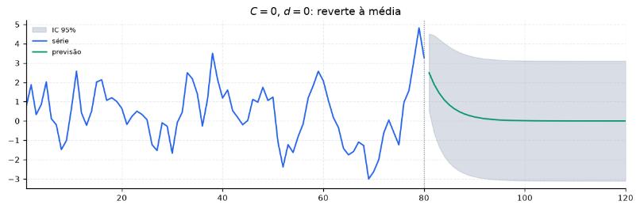
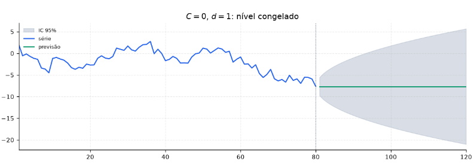
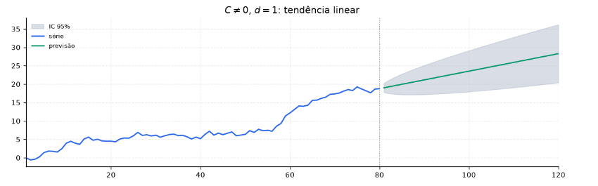
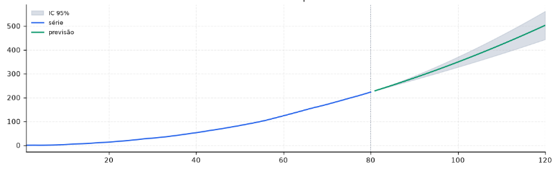

[Séries Temporais](index.md)

<!-- wiki:original:inicio -->

# Modelo ARIMA

O modelo $\text{ARIMA}(p,d,q)$ unifica tudo que vimos de modelagem de séries temprais até o momento

1.  $I(d)$ (Integração/Diferenciação): Remove a **tendência estocástica** e ajusta o nível da série original $y_{t}$ através de $d$ diferenças para torná-la estacionária: $y_{t}^{\ast} = (1 - B)^{d}y_{t}$

2.  $\text{AR}(p)$ (Autoregressivo): Modela a dependência temporal (**memória**) da série diferenciada $y_{t}^{\ast}$ através de $p$ lags passados: $y_{t}^{\ast} = \varphi_{1}y_{t - 1}^{\ast} + \ldots + \varphi_{p}y_{t - p}^{\ast} + \varepsilon_{t}$

3.  $\text{MA}(q)$ (Média Móvel): Modela a dependência temporal nos erros passados $\varepsilon_{t}$ através de $q$ lags passados: $y_{t}^{\ast} = \varepsilon_{t} + \theta_{1}\varepsilon_{t - 1} + \ldots + \theta_{q}\varepsilon_{t - q}$

## Formulação Geral

Aplicando $d$ diferenças na série original $y_{t}$, temos a série diferenciada $y_{t}^{\ast} = (1 - B)^{d}y_{t}$, então $y_{t}^{\ast}$ segue um modelo $\text{ARMA}(p,q)$:

$$
y_{t}^{\ast} = C + \varphi_{1}y_{t - 1}^{\ast} + \ldots + \varphi_{p}y_{t - p}^{\ast} + \varepsilon_{t} + \theta_{1}\varepsilon_{t - 1} + \ldots + \theta_{q}\varepsilon_{t - q}\text{\quad\quad}\varepsilon_{t} \sim \text{ WN}\left( 0,\sigma^{2} \right)
$$

Lembrando que $B^{k}y_{t} = y_{t - k}$, conseguimos simplificar a equação acima usando o operador de defasagem $B$:

$$
y_{t}^{\ast} = C + \left( \varphi_{1}B + \varphi_{2}B^{2} + \ldots + \varphi_{p}B^{p} \right)y_{t}^{\ast} + \left( 1 + \theta_{1}B + \theta_{2}B^{2} + \ldots + \theta_{q}B^{q} \right)\varepsilon_{t}
$$

 colocando os $y_{t}^{\ast}$ em evidência e usando a definição $y_{t}^{\ast} = (1 - B)^{d}y_{t}$, conseguimos o modelo simplificado do $\text{ARIMA}(p,d,q)$:

$$
\underset{\text{ AR}}{\underbrace{\left( 1 - \varphi_{1}B - \varphi_{2}B^{2} - \ldots - \varphi_{p}B^{p} \right)}}\underset{\text{ I}}{\underbrace{(1 - B)^{d}y_{t}}} = C + \underset{\text{ MA}}{\underbrace{\left( 1 + \theta_{1}B + \theta_{2}B^{2} + \ldots + \theta_{q}B^{q} \right)\varepsilon_{t}}}
$$

## $C$ e $d$ em Previsões de Longo Prazo

O $C$ e $d$ tem um papel conjunto muito importante na previsão de longo prazo da série

### $C = 0$ e $d = 0$

Previsão de longo prazo converge para a média da série original $y_{t}$.

$$
\lim\limits_{h \rightarrow \infty}{\hat{Y}}_{T + h\vert T} = \mu = \frac{C}{1 - \sum_{i = 1}^{p}\varphi_{i}}
$$

*Figura 26. Previsão de longo prazo converge para a média da série*

### $C = 0$ e $d = 1$

A previsão congela no último valor observado da série original $y_{t}$.

$$
\lim\limits_{h \rightarrow \infty}{\hat{Y}}_{T + h\vert T} = y_{T}
$$

*Figura 27. Previsão de longo prazo congela no último valor observado da série*

### $C \neq 0$ e $d = 1$

A constante $C$ se torna-se a **inclinação** de uma **tendêncial linear determinística** no nível original de $y$

$$
\begin{array}{r} {\hat{Y}}_{T + h\vert T} \approx {\hat{Y}}_{T\vert T} + h \cdot \mu_{\Delta y} \\ \mu_{\Delta y} = \frac{C}{1 - \sum_{i = 1}^{p}\varphi_{i}} \end{array}
$$

*Figura 28. Previsão de longo prazo com \$C!=0\$ e \$d=1\$ gera tendência linear determinística no nível original*

### $d = 2$

Gera uma previsão com curvatura quadrática

*Figura 29. Previsão de longo prazo com \$d=2\$ gera tendência quadrática determinística no nível original*

## Por que $\text{ARMA}$ e não só $\text{AR}$ ou $\text{MA}$?

Acontece que os modelos $\text{AR}$ e $\text{MA}$ modelam dois extremos diferentes, um cobre dependência temporal dentro das observações passadas (AR) e o outro cobre dependência temporal dentro dos erros passados (MA). A combinação de ambos permite capturar padrões mais complexos de memória temporal, tornando o modelo mais flexível e capaz de se ajustar melhor a uma variedade maior de séries temporais com menos parâmetros do que um modelo puramente AR ou MA.

Além disso, como vimos, teóricamente, todo modelo $\text{AR}(p)$ estacionário pode ser representado como um modelo $\text{MA}(\infty)$ e vice-versa, então para aproximar cada um, eu necessitaria de **muitos** parâmetros no outro, gerando risco de **overfitting** e perda de interpretabilidade.

Aqui utilizamos do princípio da parcimônia: **prefira o modelo mais simples que se ajuste bem aos dados**. Se um modelo $\text{AR}(p)$ com poucos parâmetros consegue capturar a memória temporal de uma série, não há necessidade de adicionar mais parâmetros de média móvel. O mesmo vale para o contrário.
<!-- wiki:original:fim -->

## Percurso de estudo

[Trilha: A1](../../trilhas/series-temporais/a1.md) · [Apresentação e contexto da fonte](../../trilhas/series-temporais/a1.md#apresentacao-original)

- Anterior: [Modelos MA e Invertibilidade](modelos-ma-e-invertibilidade.md)

- Próximo: [Estimação de Critérios de Informação](estimacao-e-criterios-de-informacao.md)
