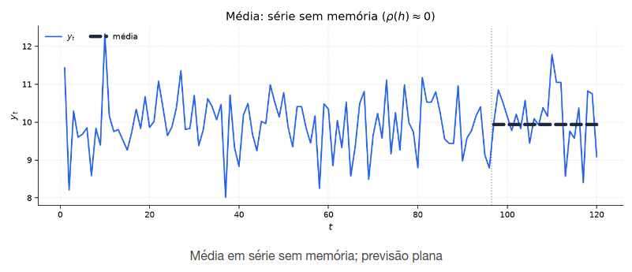
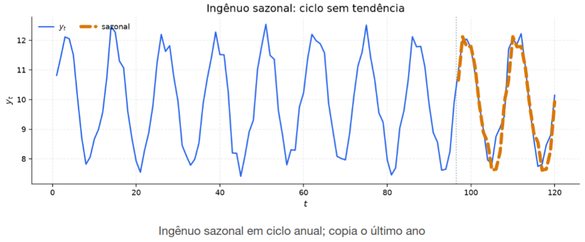

[Séries Temporais](index.md)

<!-- wiki:original:inicio -->

# Previsão e Baselines

No capítulo passado, nós definimos ACF, e como podemos utilizar ela para **diagnosticar** a presença de memória linear em uma série temporal. No entanto, não falamos sobre como utilizar essa informação para **prever** o futuro da série temporal

## Previsão via Autocorrelação $\rho(h)$ e Esperança Condicional

**Definição**

Seja $\left\{ Y_{t} \right\}$ um processo estocástico **gaussiano** e **fracamente estacionário**, com média constante ${\mathbb{E}}\left\lbrack Y_{t} \right\rbrack = \mu$, variância ${\mathbb{V}}\left\lbrack Y_{t} \right\rbrack = \gamma_{Y}(0) = \sigma^{2}$ e função de autocorrelação $\rho_{Y}(h) = \gamma_{Y}(h)/\sigma^{2}$. O vetor formado pela observação presente $Y_{n}$ e pela observação futura $Y_{n + h}$ segue uma [distribuição normal](../probabilidade/distribuicoes-continuas.md#secao_dist_normal) bivariada

$$
\begin{pmatrix} Y_{n} \\ Y_{n + h} \end{pmatrix} \sim \mathcal{N}(\begin{pmatrix} \mu \\ \mu \end{pmatrix},\begin{pmatrix} \sigma^{2} & \rho_{Y}(h)\sigma^{2} \\ \rho_{Y}(h)\sigma^{2} & \sigma^{2} \end{pmatrix})
$$

**Teorema: Condicional Gaussiana**

Sob a hipótesse de gaussianidade no processo $\left\{ Y_{t} \right\}$, a distribuição condicional de $Y_{n + h}$ dado $Y_{n} = y_{n}$ é dada por

$$
Y_{n + h}~\vert ~Y_{n} = y_{n} \sim \mathcal{N}(\mu + \rho_{Y}(h)\left( y_{n} - \mu \right),\sigma^{2}\left( 1 - \rho_{Y}(h)^{2} \right))
$$

**Demonstração**

Defina a variável transformada $Z = \left( Y_{n + h} - \mu \right) - \beta\left( Y_{n} - \mu \right)$ onde $\beta$ é uma constante real **a ser determinada** para que $Z$ e $Y_{n}$ sejam **não-correlacionadas**. Pela definição de covariância, temos que

$$
\begin{aligned} \text{ Cov}\left( Z,Y_{n} \right) & = \text{ Cov}\left( \left( Y_{n + h} - \mu \right) - \beta\left( Y_{n} - \mu \right),Y_{n} \right) \\ & = \text{ Cov}\left( Y_{n + h},Y_{n} \right) - \beta{\mathbb{V}}\left\lbrack Y_{n} \right\rbrack \\ & = \gamma_{Y}(h) - \beta\sigma^{2} \end{aligned}
$$

para anular a covariância, escolhemos $\beta = \frac{\gamma_{Y}(h)}{\sigma^{2}} = \rho_{Y}(h)$, assim:

$$
Z = \left( Y_{n + h} - \mu \right) - \rho_{Y}(h)\left( Y_{n} - \mu \right)
$$

como $\left( Z,Y_{n} \right)$ é um vetor normal, temos que o fato de $\text{Cov}\left( Z,Y_{n} \right) = 0$ implica que $Z$ e $Y_{n}$ são independentes. Utilizando desse fato, sabemos que

$$
\begin{aligned} {\mathbb{E}}\left\lbrack Z~\vert ~Y_{n} \right\rbrack = {\mathbb{E}}\lbrack Z\rbrack & = 0 \\ {\mathbb{E}}\left\lbrack Y_{n + h} - \mu - \rho_{Y}(h)\left( Y_{n} - \mu \right)~\vert ~Y_{n} \right\rbrack & = 0 \\ {\mathbb{E}}\left\lbrack Y_{n + h}~\vert ~Y_{n} \right\rbrack - \mu - \rho_{Y}(h)\left( Y_{n} - \mu \right) & = 0 \\ {\mathbb{E}}\left\lbrack Y_{n + h}~\vert ~Y_{n} \right\rbrack & = \mu + \rho_{Y}(h)\left( Y_{n} - \mu \right) \end{aligned}
$$

Já para a variância condional, temos que

$$
\begin{aligned} {\mathbb{V}}\left\lbrack Y_{n + h}~\vert ~Y_{n} \right\rbrack & = {\mathbb{V}}\left\lbrack Z + \rho_{Y}(h)\left( Y_{n} - \mu \right)~\vert ~Y_{n} \right\rbrack \end{aligned}
$$

 como é DADO $Y_{n}$, o termo $\rho_{Y}(h)\left( Y_{n} - \mu \right)$ é uma constante, logo

$$
\begin{aligned} {\mathbb{V}}\left\lbrack Y_{n + h}~\vert ~Y_{n} \right\rbrack & = {\mathbb{V}}\left\lbrack Z~\vert ~Y_{n} \right\rbrack = {\mathbb{V}}\lbrack Z\rbrack \\ & = {\mathbb{V}}\left\lbrack Y_{n + h} - \mu - \rho_{Y}(h)\left( Y_{n} - \mu \right) \right\rbrack \\ & = {\mathbb{V}}\left\lbrack Y_{n + h} \right\rbrack + \rho_{Y}(h)^{2}{\mathbb{V}}\left\lbrack Y_{n} \right\rbrack - 2\rho_{Y}(h)\text{ Cov}\left( Y_{n + h},Y_{n} \right) \\ & = \sigma^{2} + \rho_{Y}(h)^{2}\sigma^{2} - 2\rho_{Y}(h)\gamma_{Y}(h) \\ & = \sigma^{2} + \rho_{Y}(h)^{2}\sigma^{2} - 2\rho_{Y}(h)^{2}\sigma^{2} \\ & = \sigma^{2}\left( 1 - \rho_{Y}(h)^{2} \right) \end{aligned}
$$

Dado esse contexto, podemos agora mostrar que para **qualquer preditor $g\left( Y_{n} \right)$**, **o preditor que minimiza o erro quadrático médio** é a **[média condicional](../probabilidade/variaveis-aleatorias-continuas-bidimensionais.md#esperanca-condicional) ${\mathbb{E}}\left\lbrack Y_{n + h}~\vert ~Y_{n} \right\rbrack$**.

**Teorema: Preditor que minimiza o MSE**

Para qualquer preditor $g\left( Y_{n} \right)$ baseado na observação $Y_{n}$, o preditor que minimiza o erro quadrático médio (${\mathbb{E}}\left\lbrack \left( Y_{n + h} - g\left( Y_{n} \right) \right)^{2} \right\rbrack$) é dado por

$$
g\left( Y_{n} \right) = {\mathbb{E}}\left\lbrack Y_{n + h}~\vert ~Y_{n} \right\rbrack
$$

**Demonstração**

Definindo o erro quadrático médio como $f$, temos:

$$
\begin{aligned} f\left( y_{n} \right) & = {\mathbb{E}}\left\lbrack \left( Y_{n + h} - g\left( Y_{n} \right) \right)^{2}\vert Y_{n} = y_{n} \right\rbrack \end{aligned}
$$

expandindo o termo quadrático, derivando e igualando a $0$, vamos ter que

$$
g\left( Y_{n} \right) = {\mathbb{E}}\left\lbrack Y_{n + h}~\vert ~Y_{n} = y_{n} \right\rbrack
$$

Sob a hipótese de gaussianidade, o preditor linear possui forma fechada de:

$$
{\mathbb{E}}\left\lbrack Y_{n + h}~\vert ~Y_{n} \right\rbrack = \mu + \rho_{Y}(h)\left( Y_{n} - \mu \right)
$$

 no entanto, sem essa premissa, o preditor linear pode não possuir forma fechada, mas ainda assim é o preditor que minimiza o erro quadrático médio. E como podemos perceber, a função $\rho_{Y}(h)$ determina diretamente a qualidade e o formato da predição

- $\rho_{Y}(h) \rightarrow 0$: A previsão tende a $\mu$ e o erro quadrático médio tende a $\sigma^{2}$, ou seja, a informação presente $Y_{n}$ não traz informação útil sobre o futuro $Y_{n + h}$. O melhor preditor reduz-se à média incondicional e a incerteza atinge a variância total da série

- $\rho_{Y}(h) \rightarrow 1$: A previsão tende a $Y_{n}$ e o erro quadrático médio tende a $0$, ou seja, a informação presente $Y_{n}$ praticamente carrega toda a informação sobre o futuro $Y_{n + h}$. O melhor preditor aproxima-se do valor atual e a incerteza diminui significativamente

Mas como eu comentei antes, esse é o melhor preditor **sobre gaussianiedade**, mas não necessariamente o melhor preditor **sobre a série temporal**. No entanto, é possível chegar que, definindo um preditor genérico $l\left( Y_{n} \right) = \alpha Y_{n} + \beta$, o melhor $l$ é exatamente o preditor linear que obtivemos na prova anterior

**Teorema: Preditor Linear que minimiza o MSE**

Para qualquer preditor linear $l\left( Y_{n} \right) = \alpha Y_{n} + \beta$ baseado na observação $Y_{n}$, o preditor que minimiza o erro quadrático médio (${\mathbb{E}}\left\lbrack \left( Y_{n + h} - l\left( Y_{n} \right) \right)^{2} \right\rbrack$) é dado por

$$
l\left( Y_{n} \right) = \mu + \rho_{Y}(h)\left( Y_{n} - \mu \right)
$$

 e apresenta um erro quadrático médio de $\sigma^{2}\left( 1 - \rho_{Y}(h)^{2} \right)$

**Demonstração**

Queremos determinar os escalares $\alpha$ e $\beta$ que minimizam o erro quadrático médio

$$
f(\alpha,\beta) = {\mathbb{E}}\left\lbrack \left( Y_{n + h} - \left( \alpha Y_{n} + \beta \right) \right)^{2} \right\rbrack
$$

 expandindo o termo quadrático (e lembrando que ${\mathbb{E}}\left\lbrack Y_{n} \right\rbrack = {\mathbb{E}}\left\lbrack Y_{n + h} \right\rbrack = \mu$), temos que

$$
f(\alpha,\beta) = {\mathbb{E}}\left\lbrack Y_{n + h}^{2} \right\rbrack - 2\alpha{\mathbb{E}}\left\lbrack Y_{n}Y_{n + h} \right\rbrack - 2\beta\mu + \alpha^{2}{\mathbb{E}}\left\lbrack Y_{n}^{2} \right\rbrack + 2\alpha\beta\mu + \beta^{2}
$$

 e derivando com relação à $\alpha$

$$
\frac{\partial f}{\partial\alpha} = - 2{\mathbb{E}}\left\lbrack Y_{n}Y_{n + h} \right\rbrack + 2\alpha{\mathbb{E}}\left\lbrack Y_{n}^{2} \right\rbrack + 2\beta\mu = 0
$$

 igualando a $0$ e isolando $\alpha$, temos que

$$
\alpha = \frac{{\mathbb{E}}\left\lbrack Y_{n}Y_{n + h} \right\rbrack - \beta\mu}{\mathbb{E}}\left\lbrack Y_{n}^{2} \right\rbrack
$$

 agora derivando com relação à $\beta$

$$
\frac{\partial f}{\partial\beta} = - 2\mu + 2\alpha\mu + 2\beta = 0
$$

 igualando a $0$ e isolando $\beta$, temos que

$$
\beta = \mu(1 - \alpha)
$$

 substituindo $\beta$ na equação de $\alpha$, temos que

$$
\begin{array}{r} \alpha = \frac{{\mathbb{E}}\left\lbrack Y_{n}Y_{n + h} \right\rbrack - \mu^{2}(1 - \alpha)}{\mathbb{E}}\left\lbrack Y_{n}^{2} \right\rbrack \\ \alpha{\mathbb{E}}\left\lbrack Y_{n}^{2} \right\rbrack = {\mathbb{E}}\left\lbrack Y_{n}Y_{n + h} \right\rbrack - \mu^{2} + \alpha\mu^{2} \\ \alpha\left( {\mathbb{E}}\left\lbrack Y_{n}^{2} \right\rbrack - \mu^{2} \right) = {\mathbb{E}}\left\lbrack Y_{n}Y_{n + h} \right\rbrack - \mu^{2} \\ \alpha{\mathbb{V}}\left\lbrack Y_{n} \right\rbrack = \text{ Cov}\left( Y_{n},Y_{n + h} \right) \\ \alpha = \rho_{Y}(h) \end{array}
$$

Voltando na equação de $\beta$, temos que

$$
\beta = \mu(1 - \alpha) = \mu(1 - \rho_{Y}(h))
$$

agora substituindo na equação do preditor linear, temos que

$$
\begin{aligned} l\left( Y_{n} \right) & = \alpha Y_{n} + \beta \\ & = \rho_{Y}(h)Y_{n} + \mu(1 - \rho_{Y}(h)) \\ & = \mu + \rho_{Y}(h)\left( Y_{n} - \mu \right) \end{aligned}
$$

Substituindo isso tudo que encontramos na fórmula do erro quadrático médio, vamos acabar chegando que

$$
f(\alpha,\beta) = \sigma^{2}\left( 1 - \rho_{Y}(h)^{2} \right)
$$

## Métodos simples de previsão (baseline)

Um baseline estabelece o padrão mínimo. Se um modelo sofisticado perde para aa média ou para o último valor (previsores que vimos anteriormente), o sofisticado ainda não justificou sua complexidade. O baseline estabelece um **limite inferior** para o desempenho de modelos mais complexos.

**Definição**

${\hat{Y}}_{T + h\vert T}$ representa a previsão do valor futuro $Y_{T + h}$ dado os dados observados até o instante $T$.

### Método da média

*Figura 9. Ilustração do método da média*

Prevemos todas as observações futuras pela média aritmética histórica da amostra:

$$
{\hat{Y}}_{T + h\vert T} = {\overline{Y}}_{T} = \frac{1}{T}\sum_{t = 1}^{T}Y_{t}\text{\quad\quad}\forall h \geq 1
$$

o método da média assume que o processo é **fracamente estacionário**, sem tendência e sem [sazonalidade](diagnostico-visual.md#secao-21)

$$
Y_{t} = \mu + \varepsilon_{t},\text{\quad\quad}\varepsilon_{t} \sim \text{ WN}\left( 0,\sigma^{2} \right)
$$

Corresponde ao caso em que a autocorrelação $\rho(h) \approx 0$ para todo $h \geq 1$ (série sem memória linear)

Conseguimos notar também que esse estimador é **não-viesado** e **consistente**, ou seja, a previsão converge para o valor real da série temporal à medida que o tamanho da amostra aumenta (pois a média amostral converge para a média populacional).

**Teorema: Variância do Erro de Previsão**

$$
{\mathbb{V}}\left\lbrack \varepsilon_{T + h} \right\rbrack = \sigma^{2}\left( 1 + \frac{1}{T} \right)\text{\quad\quad}\forall h \geq 1
$$

 Ou seja, a precisão converge para a variância do ruído branco à medida que o tamanho da amostra aumenta ($T \rightarrow \infty$)

**Demonstração**

$$
\begin{aligned} {\mathbb{V}}\left\lbrack Y_{T + h} - {\overline{Y}}_{T} \right\rbrack & = {\mathbb{V}}\left\lbrack \varepsilon_{T + h} \right\rbrack \\ & = {\mathbb{V}}\left\lbrack Y_{T + h} \right\rbrack + {\mathbb{V}}\left\lbrack {\overline{Y}}_{T} \right\rbrack - 2\text{ Cov}\left( Y_{T + h},{\overline{Y}}_{T} \right) \\ & = \sigma^{2} + \frac{\sigma^{2}}{T} \\ & = \sigma^{2}\left( 1 + \frac{1}{T} \right) \end{aligned}
$$

 Aqui a covariância entre $Y_{T + h}$ e ${\overline{Y}}_{T}$ é nula, pois o ruído branco não possui memória linear, logo não há correlação entre o valor futuro e a média amostral (além de que o valor futuro está fora dos valores utilizados para a estimação da média amostral, pois $h \geq 1$)

### Método ingênuo (Passeio aleatório sem tendência)

*Figura 10. Ilustração do método ingênuo*

A previsão para qualquer horizonte futuro é o **último valor observado** da série

$$
{\hat{Y}}_{T + h\vert T} = Y_{T}\text{\quad\quad}\forall h \geq 1
$$

ele assume que o processo segue um **Passeio Aleatório** puro (não-estacionário na variância)

$$
Y_{t} = Y_{t - 1} + \varepsilon_{t},\text{\quad\quad}\varepsilon_{t} \sim \text{ IID}\left( 0,\sigma^{2} \right)
$$

É o caso limite em que a autocorrelação de curto prazo é extremamente alta ($\rho(h) \approx 1$ para $h$ pequeno). O estado atual $Y_{T}$ é a melhor estimativa para a posição futura

O erro de previsão acaba por ser a soma dos ruídos futuros acumulados

$$
Y_{T + h} - {\hat{Y}}_{T + h\vert T} = Y_{T + h} - Y_{T} = \varepsilon_{T + 1} + \ldots + \varepsilon_{T + h}
$$

É fácil ver que o estimador é não-viesado (basta tirar a esperança do erro de previsão). E podemos mostrar que a variância da previsão aumenta linearmente com o horizonte de previsão, pois a variância do erro de previsão é a soma das variâncias dos ruídos futuros

**Teorema: Variância do Erro de Previsão**

$$
{\mathbb{V}}\left\lbrack Y_{T + h} - {\hat{Y}}_{T + h\vert T} \right\rbrack = h\sigma^{2}\text{\quad\quad}\forall h \geq 1
$$

 Ou seja, a precisão da previsão diminui linearmente com o horizonte de previsão, pois a variância do erro de previsão aumenta linearmente com o horizonte de previsão

**Demonstração**

$$
\begin{aligned} {\mathbb{V}}\left\lbrack Y_{T + h} - {\hat{Y}}_{T + h\vert T} \right\rbrack & = {\mathbb{V}}\left\lbrack \varepsilon_{T + 1} + \ldots + \varepsilon_{T + h} \right\rbrack \\ & = {\mathbb{V}}\left\lbrack \varepsilon_{T + 1} \right\rbrack + \ldots + {\mathbb{V}}\left\lbrack \varepsilon_{T + h} \right\rbrack \\ & = h\sigma^{2} \end{aligned}
$$

### Método ingênuo sazonal

*Figura 11. Ilustração do método ingênuo sazonal*

Para séries com sazonalidade de período $m$ (ex: $m = 12$ para dados mensais, $m = 4$ para dados trimestrais), a previsão copia o valor observado na mesma fase do ciclo sazonal anterior

$$
{\hat{Y}}_{T + h\vert T} = Y_{T + h - m(K + 1)}\text{\quad\quad}\forall h \geq 1\text{\quad\quad}K = \left\lfloor \frac{h - 1}{m} \right\rfloor
$$

Esse método assume um modelo de **Passeio Aleatório Sazonal** sem tendência:

$$
Y_{t} = Y_{t - m} + \varepsilon_{t},\text{\quad\quad}\varepsilon_{t} \sim \text{ IID}\left( 0,\sigma^{2} \right)
$$

Já aqui, conseguimos mostrar que a incerteza cresce não com $h$, mas a **cada ciclo sazonal completo**

$$
{\mathbb{V}}\left\lbrack \varepsilon_{T + h} \right\rbrack = (K + 1)\sigma^{2}
$$

**Teorema: Variância do Erro de Previsão**

$$
{\mathbb{V}}\left\lbrack Y_{T + h} - {\hat{Y}}_{T + h\vert T} \right\rbrack = (K + 1)\sigma^{2}\text{\quad\quad}\forall h \geq 1\text{\quad\quad}K = \left\lfloor \frac{h - 1}{m} \right\rfloor
$$

 Ou seja, a precisão da previsão diminui a cada ciclo sazonal completo, pois a variância do erro de previsão aumenta a cada ciclo sazonal completo

**Demonstração**

$$
\begin{aligned} {\mathbb{V}}\left\lbrack Y_{T + h} - {\hat{Y}}_{T + h\vert T} \right\rbrack & = {\mathbb{V}}\left\lbrack \varepsilon_{T + h - m(K + 1)} + \ldots + \varepsilon_{T + h} \right\rbrack \\ & = {\mathbb{V}}\left\lbrack \varepsilon_{T + h - m(K + 1)} \right\rbrack + \ldots + {\mathbb{V}}\left\lbrack \varepsilon_{T + h} \right\rbrack \\ & = (K + 1)\sigma^{2} \end{aligned}
$$

### Método do desvio (drift)

*Figura 12. Ilustração do método do desvio*

Extrapola uma tendência linear permitindo que a previsão mude ao longo do tempo a uma taxa constante $C$

$$
{\hat{Y}}_{T + h\vert T} = Y_{T} + hC\text{\quad\quad}\forall h \geq 1
$$

onde a taxa de variação (inclinação do desvio) é estimada pela variação média por período entre a primeira e a última observação da amostra

$$
C = \frac{Y_{T} - Y_{1}}{T - 1}
$$

na intuição geométrica, estamos traçando uma linha reta entre o primeiro e o último ponto da série temporal, e projetando essa linha para frente. Esse método assume um modelo de **Passeio Aleatório com Drift (Tendência)**:

$$
Y_{t} = C + Y_{t - 1} + \varepsilon_{t},\text{\quad\quad}\varepsilon_{t} \sim \text{ WN}\left( 0,\sigma^{2} \right)
$$

## Valores Ajustados V.S Previsões

É importante notar que os métodos de previsão que vimos até agora são **modelos de previsão**, e não **modelos de ajuste**. Ou seja, eles não são modelos que descrevem a série temporal, mas sim modelos que descrevem como prever o futuro da série temporal.

Para um modelo de séries temporais ajustado sobre um conjunto de dados históricos $\mathcal{F}_{T} = \left\{ Y_{1},\ldots,Y_{T} \right\}$ temos as seguintes definições

**Definição: Valores ajustados**

O valor ajustado ${\hat{Y}}_{t\vert t - 1}$ é a estimativa **dentro da amostra** de um passo à frente ($h = 1$) para instantes passados $t = 2,3,\ldots,T$. Representa o valor que o modelo teria previsto para o instante $t$ conhecendo as observações anteriores $Y_{1},Y_{2},\ldots,Y_{t - 1}$ e com parâmetros globais **já calibrados na amostra completa**

**Definição: Previsão (Forecast)**

A previsão ${\hat{Y}}_{T + h\vert T}$ são as projeções **fora da amostra** de $h$ passos à frente ($h \geq 1$) para instantes futuros $t = T + 1,T + 2,\ldots$. Utilizam estritamente a informação disponível até o instante de corte $T$, sem qualquer acesso visual ou numérico às realizações reais de $Y_{T + h}$
<!-- wiki:original:fim -->

## Percurso de estudo

[Trilha: A1](../../trilhas/series-temporais/a1.md) · [Apresentação e contexto da fonte](../../trilhas/series-temporais/a1.md#apresentacao-original)

- Anterior: [Estacionariedade e ACF](estacionariedade-e-acf.md)

- Próximo: [Diagnóstico de Resíduos](diagnostico-de-residuos.md)
