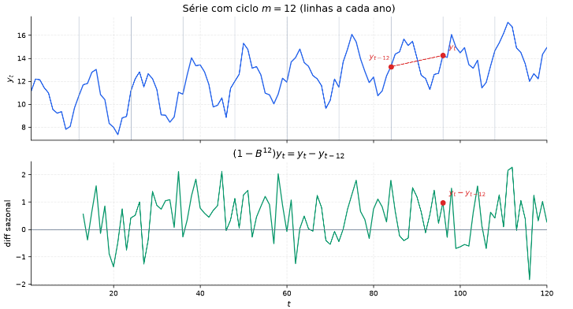
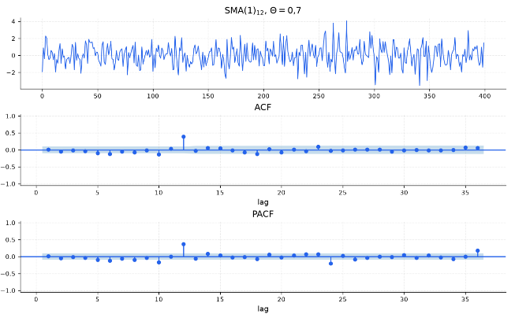

[Séries Temporais](index.md)

<!-- wiki:original:inicio -->

# SARIMA

## Motivação

As séries temporais podem apresentar padrões que se repetem em intervalos regulares, conhecidos como **sazonalidade**. Por exemplo, vendas de sorvete tendem a aumentar no verão e diminuir no inverno. Para capturar esses padrões sazonais, o modelo ARIMA é estendido para incluir componentes sazonais, resultando no modelo SARIMA (Seasonal ARIMA).

**Definição: Modelo $\text{SARIMA}(p,d,q)(P,D,Q)_{m}$**

O modelo $\text{SARIMA}(p,d,q)(P,D,Q)_{m}$ é uma extensão do modelo ARIMA que incorpora componentes sazonais. Ele é definido por:

$$
\varphi_{p}(B)\Phi_{P}\left( B^{m} \right)(1 - B)^{d}\left( 1 - B^{m} \right)^{D}y_{t} = C + \theta_{q}(B)\Theta_{Q}\left( B^{m} \right)\varepsilon_{t}
$$

 onde:

$$
\begin{aligned} \varphi_{p}(B) & = 1 - \varphi_{1}B - \varphi_{2}B^{2} - \ldots - \varphi_{p}B^{p} \\ \Phi_{P}\left( B^{m} \right) & = 1 - \Phi_{1}B^{m} - \Phi_{2}B^{2m} - \ldots - \Phi_{P}B^{Pm} \\ \theta_{q}(B) & = 1 + \theta_{1}B + \theta_{2}B^{2} + \ldots + \theta_{q}B^{q} \\ \Theta_{Q}\left( B^{m} \right) & = 1 + \Theta_{1}B^{m} + \Theta_{2}B^{2m} + \ldots + \Theta_{Q}B^{Qm} \\ \varepsilon_{t} \sim \text{ WN}\left( 0,\sigma^{2} \right) \end{aligned}
$$

 e $m$ representa a sazonalidade dos dados (por exemplo, $m = 4$ para dados trimestrais, $m = 12$ para dados mensais)

A lógica aqui é que a adição dos termos sazonais permite que o modelo capture padrões que se repetem a cada $m$ períodos, enquanto os termos não sazonais continuam a capturar a dinâmica de curto prazo da série, por exemplo, se pegamos o operador $1 - B^{m}$ e aplicamos em $y_{t}$, temos

$$
\left( 1 - B^{m} \right)y_{t} = y_{t} - y_{t - m}
$$

 e se existe um padrão sazonal, essa diferença deveria capturar justamente esse padrão sazonal e se manter estável ao longo do tempo.

## Diferenciação Sazonal ($D$) v.s Regular ($d$)

*Figura 30. Série sem diferenciação sazonal e com diferenciação sazonal (D=1 e m=12)*

A ordenação na aplicação das diferenças é crucial para evitar distorções na estrutura estocástica da série. A prioridade deve ser primeiramente aplicar a diferenciação sazonal $1 - B^{m}$ e depois a regular $1 - B$. Se tentássemos aplicar a diferenciação regular antes da sazonal, a sazonalidade na nova série ficaria **distorcida**

Após aplicarmos a diferenciação sazonal, podemos inspecionar o gráfico e utilizar do teste KPSS para decidir se é necessário aplicar a diferenciação regular.

Em aplicações reais, é **muito raro** de precisarmos aplicar a diferenciação sazonal mais de uma vez ($D > 1$).

No SARIMA, o [incomparabilidade entre modelos com diferentes diferenciações](estimacao-e-criterios-de-informacao.md#different-d-invalidity) se aplica tanto para a diferenciação sazonal $D$ quanto para a regular $d$. Modelos com diferentes níveis de diferenciação não podem ser comparados diretamente em termos de AIC ou BIC, pois eles representam funções de densidade de probabilidade em espaços de medida distintos. Portanto, ao comparar modelos SARIMA, é essencial que os modelos tenham os mesmos valores de $d$ e $D$.

## O problema do over differencing sazonal

Imagine que você está analisando as vendas de uma sorveteria. Todo mês de dezembro as vendas sobem exatamente $1000$ unidades devido ao verão, e todo mês de julho elas caem exatamente $500$ unidades. Essa sazonalidade é **perfeitamente fixa** e **previsível**

$$
S_{t} = S_{t - 12}
$$

sua venda real no mês $t$ é dada por

$$
y_{t} = S_{t} + \varepsilon_{t}
$$

onde $\varepsilon_{t}$ é um ruído branco puro — ou seja, erros aleatórios imprevisíveis que não têm correlação nenhuma de um mês para o outro

Aqui a sazonalidade já é fixa, então você **não precisa diferenciar**, mas vamos aplicar a diferenciação mesmo assim e ver o que vai acontecer

$$
w_{t} = y_{t} - y_{t - 12} = S_{t} + \varepsilon_{t} - S_{t - 12} - \varepsilon_{t - 12} = \varepsilon_{t} - \varepsilon_{t - 12}
$$

Analisando $w_{t}$ e $w_{t - 12}$, conseguimos ver que

$$
\begin{array}{r} w_{t} = \varepsilon_{t} - \varepsilon_{t - 12} \\ w_{t - 12} = \varepsilon_{t - 12} - \varepsilon_{t - 24} \end{array}
$$

 os ruídos se repetem em ambas as equações, de forma que o que deveria ser apenas ruído que interfere em um mês, agora se tornou um ruído que **se repete** em ambos os meses, criando uma correlação artificial entre $w_{t}$ e $w_{t - 12}$.

Se calcularmos a correlação entre $w_{t}$ e $w_{t - 12}$ (o lag sazonal): A variância de $w_{t}$ é ${\mathbb{V}}\lbrack\varepsilon_{t} - \varepsilon_{t - 12}) = \sigma^{2} + \sigma^{2} = 2\sigma^{2}$. A covariância entre $w_{t}$ e $w_{t - 12}$ vem apenas do termo compartilhado: $\text{Cov}\left( - \varepsilon_{t - 12},\varepsilon_{t - 12} \right) = - \sigma^{2}$. A autocorrelação no lag 12 será:

$$
\rho(12) = \frac{- \sigma^{2}}{2\sigma^{2}} = - 0.5
$$

Por que isso é uma armadilha? Quando você olha para o gráfico da ACF dessa série diferida, você vê um pico negativo enorme de ${-} 0.5$ exatamente no lag $12$. O analista inexperiente pensa: *“Nossa, tem uma autocorrelação fortíssima de ${-} 0,5$ no lag $12$! Preciso colocar mais parâmetros ou diferir de novo!”*. A realidade matemática: Essa correlação de ${-} 0.5$ não existia nos dados originais. Foi você que a fabricou ao aplicar a diferença $\left( 1 - B^{12} \right)$ em algo que era apenas um ruído branco em torno de uma sazonalidade fixa. Essa estrutura $w_{t} = \varepsilon_{t} - 1 \cdot \varepsilon_{t - 12}$ é a definição exata de um processo ${\text{SMA}(1)}_{12}$ com $\Theta_{1} = - 1$.

## Identificação Sazonal

Após obter a série estacionária $y_{t}^{\ast} = (1 - B)^{d}\left( 1 - B^{m} \right)^{D}y_{t}$, a identificação das ordens sazonais $(P,Q)$ é realizada inspecionando exclusivamente o comportamento dos gráficos de ACF e PACF nos lags múltiplos do período ($m,2m,3m,\ldots$)

*Figura 31. Identificação de ordens sazonais \$(P, Q)\$ a partir da ACF e PACF*

## Ordem Prática

Na prática, podemos seguir um conjunto de passos para realizar a modelagem das séries

1.  Fixar $m$ (calendário/gráfico)

2.  Fixar $D$ pelo gráfico (ciclo/ACF sazonal); Decidir $d$ pelo gráfico + teste KPSS **depois** de $D$

3.  ACF/PACF em $y^{\ast}$:

    1.  lags $1,2,\ldots$ para decidir $(p,q)$

    2.  lags $m,2m,\ldots$ para decidir $(P,Q)$

4.  Estimação e seleção via $\text{AICc}$ (mesmo $d$ e $D$)
<!-- wiki:original:fim -->

## Percurso de estudo

[Trilha: A1](../../trilhas/series-temporais/a1.md) · [Apresentação e contexto da fonte](../../trilhas/series-temporais/a1.md#apresentacao-original)

- Anterior: [Estimação de Critérios de Informação](estimacao-e-criterios-de-informacao.md)
