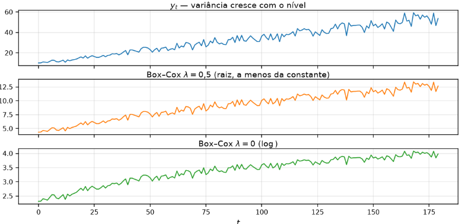

[Séries Temporais](index.md)

<!-- wiki:original:inicio -->

# Transformações

Muitos modelos (e a ACF que já usamos) pedem algo próximo de **estacionariedade** fraca: média e variância estáveis no tempo, sem tendência óbvia. Só que isso óbviamente pode não ocorrer na vida real e para cada **falha** lidamos de uma forma diferente

- **Variância muda com o nível**: Transformação de potência

- **Nível muda com o tempo**: Diferenciação

**Primeiro estabiliza-se a variância (Box-Cox), depois aplica-se a diferenciação.** *Por quê?* Diferenciar com o leque ainda aberto faz a série diferenciada misturar mudança de nível com mudança de escala ao mesmo tempo, destruindo o diagnóstico gráfico e da ACF

## Box-Cox

A transformação de box-cox é uma transformação para séries que apresentam variância crescente com o nível da série ($y_{t}$). A ideia é que, se a variância cresce com o nível, então uma transformação de potência pode estabilizar a variância.

**Definição: Transformação de Box-Cox**

Para séries estritamente positivas $y_{t} > 0$, a transformação de Box-Cox é definida como

$$
w_{t} = \begin{cases} \log(y_{t})\text{\quad\quad} & \lambda = 0 \\ \frac{y_{t}^{\lambda} - 1}{\lambda}\text{\quad\quad} & \lambda \neq 0 \end{cases}
$$

 onde $\lambda$ é um híperparâmetro que controla a intensidade da transformação.

*Figura 22. Ilustração da transformação de Box-Cox*

Perceba que na imagem original, a variância cresce conforme o tempo vai passando, já as transformações estabilizam essa variância. Em software, o correto é estimar o $\lambda$ ótimo via **Maximum Likelihood** e aplicar a transformação, mas para fins didáticos, testamos apenas alguns valores de $\lambda$ e ver qual estabiliza melhor a variância. O gráfico serve também para ver se o $\lambda$ faz sentido.

Depois que modelamos o $w$, precisamos que a previsão volte para a escala de $y$, afinal, se eu quero prever **litros de água**, não posso entregar **logaritmo de litros de água**.

Para intervalos de confiança, aplicamos a inversa da transformação nos extremos do intervalo

$$
{\mathbb{P}}(w_{1} \leq W \leq w_{2}) = 1 - \alpha \Rightarrow {\mathbb{P}}(g^{- 1}\left( w_{1} \right) \leq Y \leq g^{- 1}\left( w_{2} \right)) = 1 - \alpha
$$

 onde a inversa é definida como

$$
g^{- 1}(w) = \begin{cases} \exp(w)\text{\quad\quad} & \lambda = 0 \\ (\lambda w + 1)^{\frac{1}{\lambda}}\text{\quad\quad} & \lambda \neq 0 \end{cases}
$$

Porém, temos que tomar cuidado. Por conta da **desigualdade de Jensen**, eu **não posso** estimar a média de $W$ e aplicar $g^{- 1}$ nela para tentar estimar a média de $Y$.

Não vamos demonstrar o método de delta nesse capítulo (feito no documento de [Modelagem Estatística](https://github.com/Holy-Emapian-Scripture/holy-emapian-scripture/tree/main/5%20semestre/Modelagem%20Estat%C3%ADstica/Recaps)), mas vamos utilizar dele para estimar o resultado do box-cox. A **premissa** é que o desvio padrão pode ser escrita na forma

$$
\sigma\left( Y_{t} \right) = c \cdot g\left( \mu_{t} \right)
$$

 onde $\mu_{t}$ é a média de $Y_{t}$ e $c$ é uma constante. Além disso, $f$ é a transformação de box-cox:

- **Caso 1** ($g\left( \mu_{t} \right) = \mu_{t}$): Se o desvio padrão cresce linearmente com a média, então

$$
f'\left( \mu_{t} \right) \propto \frac{1}{\mu_{t}} \Rightarrow f(y) = \int\frac{1}{y}dy = \log(y)\text{\quad\quad}(\lambda = 0)
$$

- **Caso 2** ($g\left( \mu_{t} \right) = \mu_{t}^{1 - \lambda}$): Se o desvio padrão cresce com a média elevada a uma potência, então

$$
f'\left( \mu_{t} \right) \propto \frac{1}{\mu_{t}^{1 - \lambda}} \Rightarrow f(y) = \int\frac{1}{y^{1 - \lambda}}dy = \frac{y^{\lambda} - 1}{\lambda}\text{\quad\quad}(\lambda \neq 0)
$$

## Operador de Defasagem (Backshift)

Compacta a álgebra do atraso temporal

$$
B^{k}y_{t} = y_{t - k}\text{\quad\quad}k \in {\mathbb{Z}}
$$

- Primeira diferença: $(1 - B)y_{t} = y_{t} - y_{t - 1}$

- Diferença de ordem $d$: $(1 - B)^{d}y_{t}$

- Diferença sazonal de período $m$: $\left( 1 - B^{m} \right)y_{t} = y_{t} - y_{t - m}$

## Diferenciação

É a transformação que aplicamos para **remover** a **tendência** da média temporal, deixando apenas a variabilidade aleatória.

**Teorema: Teorema da Aniquilação de Tendências Polinomiais por Diferenciação**

Seja $Y_{t} = P_{k}(t) + \varepsilon_{t}$ um processo onde $P_{k}(t) = \sum_{j = 0}^{k}a_{j}t^{j}$ é um polinômio determinístico de grau $k \geq 1$ em $t$ (com $a_{k} \neq 0$) e $\varepsilon_{t} \sim \text{ WN}\left( 0,\sigma^{2} \right)$.

A $k$-ésima diferença regular $Y_{t}^{\ast} = (1 - B)^{k}Y_{t}$ anula completamente a dependência do tempo $t$ na média, tornando a esperança do processo constante (estacionária em média) e igual a:

$$
{\mathbb{E}}\left\lbrack (1 - B)^{k}Y_{t} \right\rbrack = k! \cdot a_{k}
$$

**Demonstração**

Seja $\Delta = 1 - B$, vamos avaliar o comportamento do operador sob um **monômio** de **grau $j$**.

$$
\Delta t^{j} = (1 - B)t^{j} = t^{j} - (t - 1)^{j}
$$

 por binômio de newton, $(t - 1)^{j} = t^{j} - jt^{j - 1} + O\left( t^{j - 2} \right)$, logo:

$$
\Delta t^{j} = jt^{j - 1} + O\left( t^{j - 2} \right)
$$

 como conclusão intermediária, temos que o operador de diferença $\Delta$ diminui o grau de qualquer termo polinomial de grau $j$ para $j - 1$ e multiplicando pelo coeficiente $j$.

Agora vamos aplicar o operador $k$ vezes em $Y_{t}$

$$
\Delta^{k}Y_{t} = \Delta^{k}P_{k(t)} + \Delta^{k}\varepsilon_{t}
$$

 focando no comportamento do operador no polinômio, temos que

$$
\Delta^{k}P_{k}(t) = \Delta^{k}\sum_{j = 0}^{k}a_{j}t^{j} = \sum_{j = 0}^{k}a_{j}\Delta^{k}t^{j}
$$

 para todos os termos com $j < k$, o termo $\Delta^{k}t^{j}$ será $O\left( t^{j - k} \right) = O\left( t^{- 1} \right) \rightarrow 0$ quando $t \rightarrow \infty$. O único termo que irá sobrar é o de grau $k$, que será reduzido em:

$$
\begin{aligned} \Delta^{k}t^{k} & = \Delta^{k - 1}\left( kt^{k - 1} + O\left( t^{k - 2} \right) \right) \\ & = k\Delta^{k - 1}t^{k - 1} + O\left( t^{k - 2} \right) \\ & = k(k - 1)\Delta^{k - 2}t^{k - 2} + O\left( t^{k - 3} \right) \\ & = \ldots \\ & = k! + O\left( t^{- 1} \right) \rightarrow k! \end{aligned}
$$

Então tomando a esperança

$$
{\mathbb{E}}\left\lbrack (1 - B)^{k}Y_{t} \right\rbrack = {\mathbb{E}}\left\lbrack \Delta^{k}P_{k(t)} \right\rbrack + {\mathbb{E}}\left\lbrack \Delta^{k}\varepsilon_{t} \right\rbrack = k!a_{k} + 0 = k!a_{k}
$$

Logo, aplicar o operador de diferença $k$ vezes em um polinômio de grau $k$ anula completamente a dependência do tempo $t$ na média, e isso implica em **ausência de tendência** na série temporal diferenciada (o contrário não vale, ausência de tendência não implica que a média não tenha dependência temporal).

Falar que a tendência segue uma forma polinomial parece ser muito forte, mas é **muito raro** no dia a dia encontrar séries temporais com tendências fora desse formato ou que não possam ser aproximadas por esse formato. O teorema acima mostra que, ao aplicar a diferenciação de ordem $k$, a tendência é completamente removida

### Diferenciação de Primeira Ordem

$$
y'_{t} = (1 - B)y_{t} = y_{t} - y_{t - 1}
$$

 Quando a média é aproximadamente linear (polinômio de grau $1$), a diferenciação a estabiliza, removendo a tendência. Dois casos limites úteis:

- Se $y'_{t} = \varepsilon_{t}$ (ruído branco): $y_{t}$ é um Passeio Aleatório Puro ($y_{t} = y_{t - 1} + \varepsilon_{t}$).

- Se $y'_{t} = c + \varepsilon_{t}$: $y_{t}$ é um Passeio Aleatório com Drift ($y_{t} = c + y_{t - 1} + \varepsilon_{t}$, tendência estocástica com inclinação constante $c$)

### Diferenciação de Segunda Ordem

$$
y''_{t} = (1 - B)^{2}y_{t} = (1 - B)y'_{t} = y'_{t} - y'_{t - 1} = y_{t} - 2y_{t - 1} + y_{t - 2}
$$

Empregada quando a primeira diferença ainda apresenta tendência (tendência quadrática, polinômio de grau $2$). Porém, devemos tomar cuidado ao diferenciar demais ($d \geq 2$ injustificado) insere autocorrelação negativa artificial nos resíduos e destrói a informação do nível da série

Com tendência e sazonalidade juntas, a ordem usual é: sazonal primeiro, depois 1ª ordem se o nível ainda vagar:

$$
(1 - B)\left( 1 - B^{m} \right)y_{t} = y_{t} - y_{t - 1} - y_{t - m} + y_{t - m - 1}
$$
<!-- wiki:original:fim -->

## Percurso de estudo

[Trilha: A1](../../trilhas/series-temporais/a1.md) · [Apresentação e contexto da fonte](../../trilhas/series-temporais/a1.md#apresentacao-original)

- Anterior: [Métricas de Avaliação](metricas-de-avaliacao.md)

- Próximo: [Modelo AR e PACF](modelo-ar-e-pacf.md)
